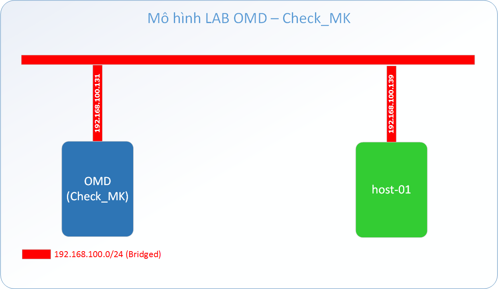
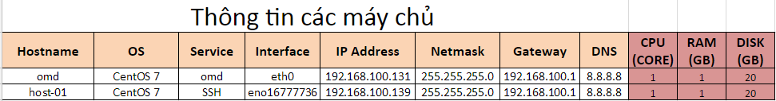
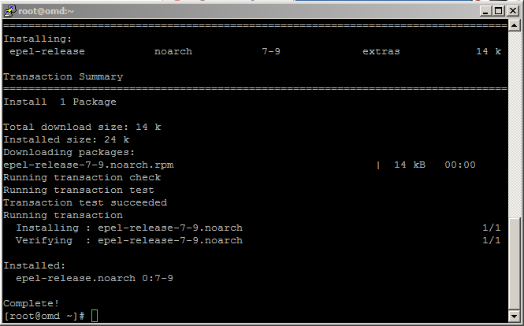
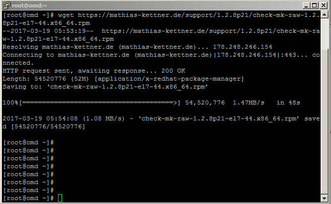
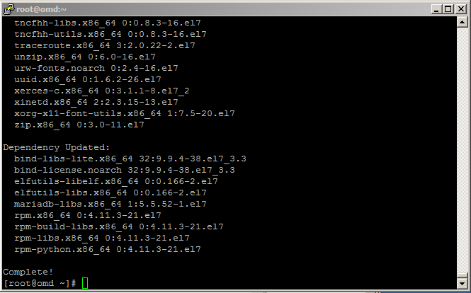
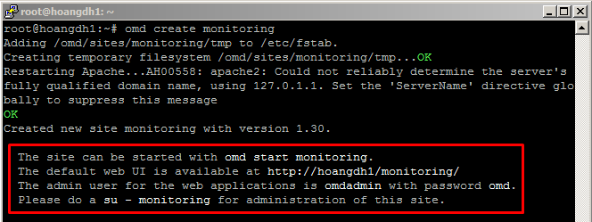
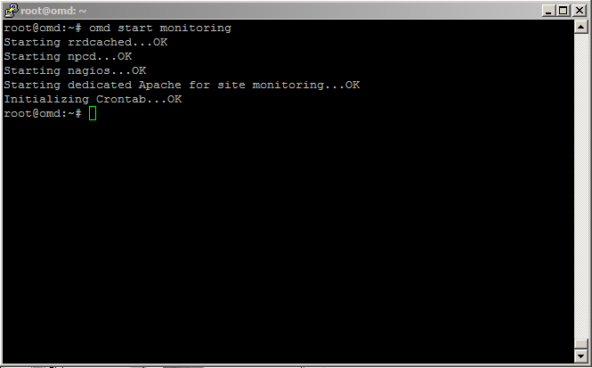
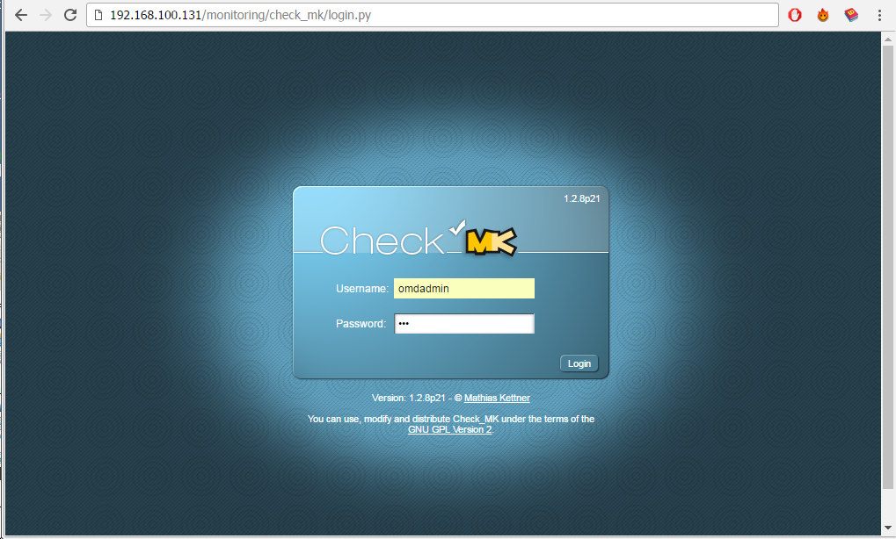
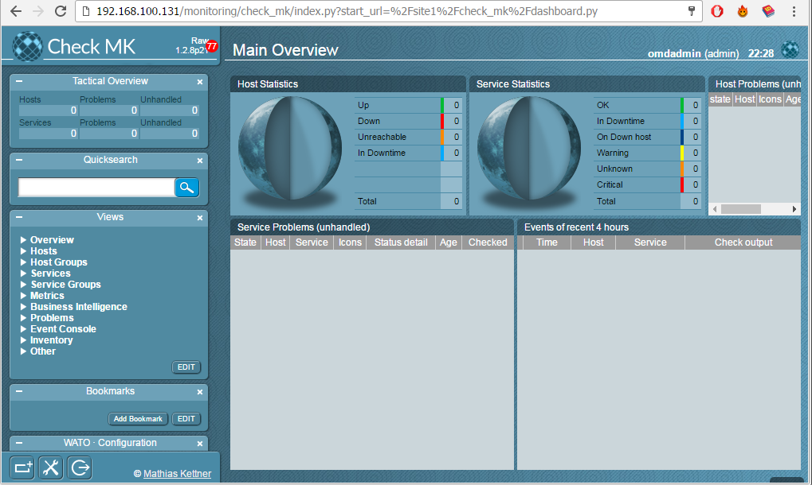

## Cài đặt OMD - Check MK trên CentOS 7

#### Menu

- [1. Mô hình triển khai](#1)
- [2. Cài đặt trên Server](#2)
    - [2.1 Cài đặt repo EPEL](#21)
    - [2.2 Tải file cài đặt OMD - Check MK](#22)
    - [2.3  Cài đặt OMD - Check MK](#23)
    - [2.4 Tạo và khởi động site trên OMD](#24)
- [3. Tham khảo](#3)

<a name="1"></a>
### 1. Mô hình triển khai

#### Mô hình triển khai



#### IP Planning



<a name="2"></a>
### 2. Cài đặt trên Server

<a name="21"></a>
#### 2.1. Cài đặt repo EPEL

`Check MK` cần khá nhiều các gói dependence đi kèm, vì thế chúng ta cài đặt thêm gói repo này để có thể đáp ứng được một số gói mà local repo không cung cấp.

```
yum install -y epel-release wget
```

Sau khi cài đặt `epel-release` xong, chúng ta sẽ được kết quả như hình.



<a name="22"></a>

#### 2.2. Tải file cài đặt OMD - Check MK

```
wget https://mathias-kettner.de/support/1.2.8p21/check-mk-raw-1.2.8p21-el7-44.x86_64.rpm
```



<a name="23"></a>
#### 2.3. Cài đặt OMD - Check MK

Chúng ta sử dụng `yum` để cài đặt gói RPM, mục đích là để yum 'hoàn thiện' những gói dependence mà `check mk` cần.

```
yum install -y check-mk-raw-1.2.*
```

Chờ cho server tự động cài đặt khoảng 5p, chúng ta thấy kết quả như sau



<a name="24"></a>
#### 2.4. Tạo và khởi động site trên OMD

- **Bước 1**: Tạo site

```
omd create monitoring
```

**Chú ý**: `monitoring` là tên tùy chọn, bạn có thể đặt bất cứ tên gì bạn muốn



Thông tin `site` được mô tả ở hình.
   
- **Bước 2**: Khởi động site

```
omd start monitoring
```



- **Bước 3:** Mở port 80 cho HTTPD trên Firewalld

Nếu server của bạn có sử dụng Firewalld, hãy mở port cho httpd bằng lệnh:

```
firewall-cmd --permanent --add-port=80/tcp
firewall-cmd --reload
```

- **Bước 4:** Tắt SELinux 

Tắt tức thời bằng lệnh:

```
setenforce 0
```

Chỉnh sửa file cấu hình của SELinux:

```
vi /etc/sysconfig/selinux
```

Sửa dòng `SELINUX=enforcing` thành `SELINUX=disabled`.


- **Bước 5**: Kiểm tra bằng trình duyệt Web

Dùng trình duyệt truy cập vào địa chỉ

```
http://192.168.100.131/monitoring
```

**Chú ý**: Thay địa chỉ IP của bạn vào đường dẫn và đăng nhập theo `omdadmin/omd`






<a name="3"></a>
### 3. Tham khảo

Script cài đặt: [Xem chi tiết](https://gist.github.com/hoangdh/f5894b682d984a9d7e8f4818d63fcc0c)

Các bài viết tiếp theo:

- [2. Cài đặt Agent trên host cần giám sát](2.Install-agent.md)
- [3. Cấu hình Active Check dịch vụ](3.Active-check.md)
- [4. Đặt ngưỡng cảnh báo cho dịch vụ](4.Set-threshold.md)
- [5. Cấu hình gửi mail cảnh báo sử dụng Gmail](5.Send-Noitify.md)
- [6. Thêm plugin vào OMD](6.Add-plugins.md)
- [7. Distributed Monitoring](7.Distributed.md)
- **Bonus:** [Quản lý các site trên OMD](Management-OMD.md)