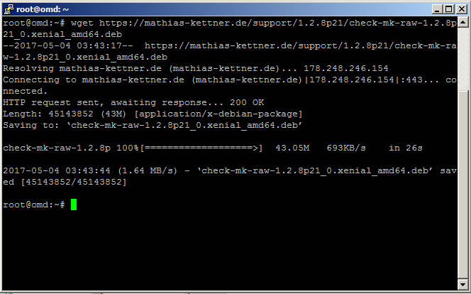
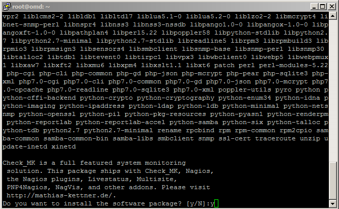
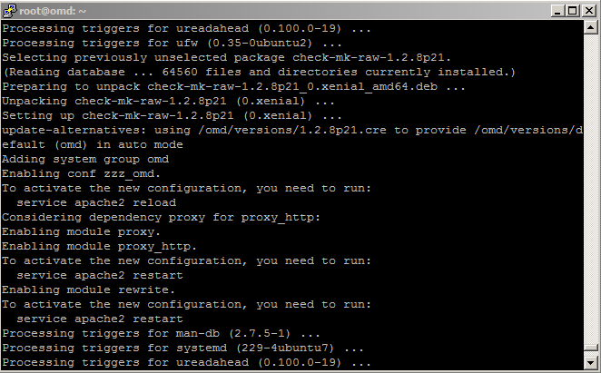

## Cài đặt OMD trên Ubuntu 16.04

### Menu

- [1. Mô hình triển khai](#1)
- [2. Cài đặt trên Server](#2)
    - [2.1 Tải file cài đặt OMD - Check MK](#21)
    - [2.2 Cài đặt gdebi](#22)
    - [2.3  Cài đặt OMD - Check MK](#23)
    - [2.4 Tạo và khởi động site trên OMD](#24)
- [3. Tham khảo](#3)

<a name="1"></a>
### 1. Mô hình triển khai

#### Mô hình triển khai


#### IP Planning

Hostname | OS | Service | IP | Netmask | Gateway | DNS | CPU (Core) | RAM (GB) | DISK (GB) |
-|-|-|-|-|-|-|-|-|-|
omd | Ubuntu 16.04 | check_mk | 192.168.100.131 | 255.255.255.0 | 192.168.100.1 | 8.8.8.8 | 1 | 2 | 20 |
host-01 | CentOS 7 | httpd | 192.168.100.139 | 255.255.255.0 | 192.168.100.1 | 8.8.8.8 | 1 | 2 | 20 |

<a name="2"></a>

### 2. Cài đặt trên Server

<a name="21"></a>
#### 2.1. Tải file cài đặt OMD - Check MK

```
wget https://mathias-kettner.de/support/1.2.8p21/check-mk-raw-1.2.8p21_0.xenial_amd64.deb
```



<a name="22"></a>
#### 2.2. Cài đặt gói `gdebi`

`Check MK` cần khá nhiều các gói dependence đi kèm, vì thế chúng ta cài đặt thêm gói này để có thể tự động cài một số gói đó.

```
apt install gdebi-core -y
apt-get update
```

Sau khi cài đặt `gdebi-core` xong, chúng ta sẽ được kết quả như hình.


<a name="23"></a>
#### 2.3. Cài đặt OMD - Check MK

Chúng ta sử dụng `gdebi` để cài đặt gói DEB, mục đích là để GDEBI 'hoàn thiện' những gói dependence mà `check mk` cần.

```
gdebi check-mk-raw-1.2.8p21_0.xenial_amd64.deb
```

Chọn `Y` để đồng ý cài đặt



Chờ cho server tự động cài đặt khoảng 5p, chúng ta thấy kết quả như sau



<a name="24"></a>
#### 2.4. Tạo và khởi động site trên OMD

- **Bước 1**: Tạo site

```
omd create monitoring
```

**Chú ý**: `monitoring` là tên tùy chọn, bạn có thể đặt bất cứ tên gì bạn muốn


Thông tin `site` được mô tả ở hình.
   
- **Bước 2**: Khởi động site

```
omd start monitoring
```


- **Bước 3:** Mở port 80 cho HTTPD trên UFW

Nếu server của bạn có sử dụng UFW, hãy mở port cho apache2 bằng lệnh:

```
ufw allow 80/tcp
ufw reload
```

- **Bước 4**: Kiểm tra bằng trình duyệt Web

Dùng trình duyệt truy cập vào địa chỉ

```
http://192.168.100.131/monitoring
```

**Chú ý**: Thay địa chỉ IP của bạn vào đường dẫn và đăng nhập theo `omdadmin/omd`


<a name="3"></a>
### 3. Tham khảo

Script cài đặt: [Xem chi tiết](https://gist.github.com/hoangdh/f7e2a65dd2f048c8650cfb45a93ad504)

Các bài viết tiếp theo:

- [2. Cài đặt Agent trên host cần giám sát](2.Install-agent.md)
- [3. Cấu hình Active Check dịch vụ](3.Active-check.md)
- [4. Đặt ngưỡng cảnh báo cho dịch vụ](4.Set-threshold.md)
- [5. Cấu hình gửi mail cảnh báo sử dụng Gmail](5.Send-Noitify.md)
- [6. Thêm plugin vào OMD](6.Add-plugins.md)
- [7. Distributed Monitoring](7.Distributed.md)
- **Bonus:** [Quản lý các site trên OMD](Management-OMD.md)