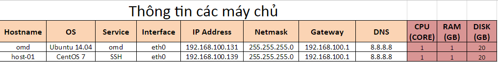
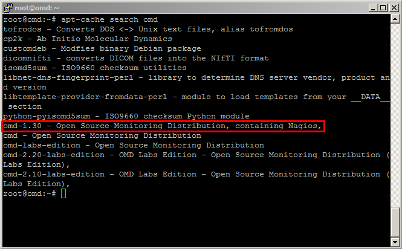
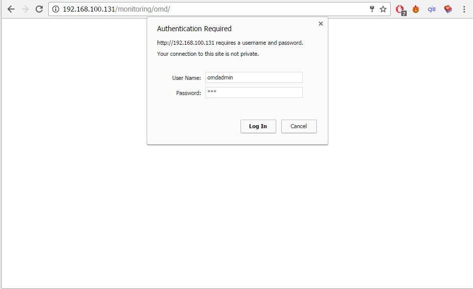
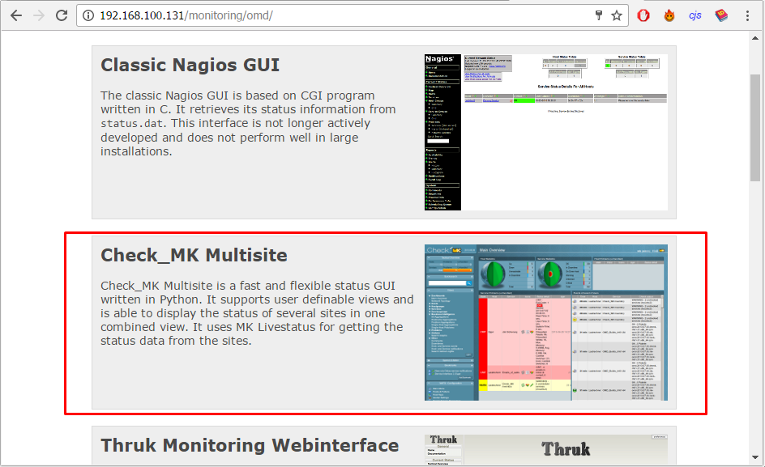
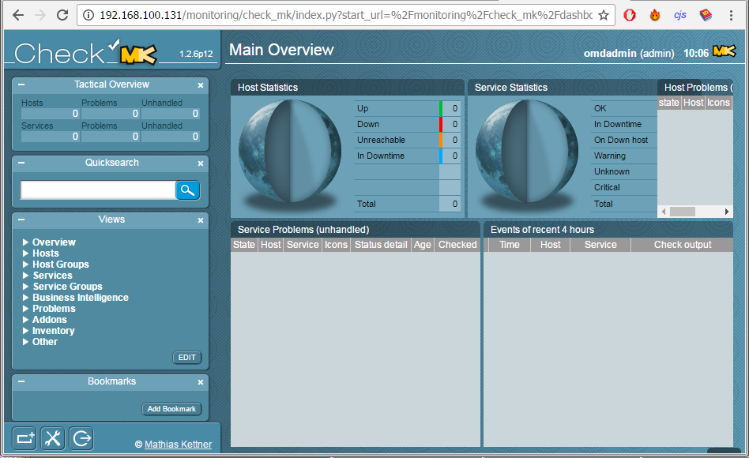

## Hướng dẫn cài đặt OMD - Check_MK trên Ubuntu 14.04

#### Menu

- [1. Giới thiệu](#1)
- [2. Cài đặt trên Server](#2)

### 1. Giới thiệu  <a name="1"></a>

#### Mô hình triển khai


#### IP Planning



Link docs: https://goo.gl/WnAJ5r

<a name="2"></a>
### 2. Cài đặt trên Server  

- **Bước 1**: Cài đặt Repo cho OMD
    - Thêm key GPG của OMD
    
    ```
    wget -q "https://labs.consol.de/repo/stable/RPM-GPG-KEY" -O - | sudo apt-key add -
    ```
    
    - Khai báo repo của OMD 
    
    ```
    echo "deb http://labs.consol.de/repo/stable/ubuntu $(lsb_release -cs) main" > /etc/apt/sources.list.d/labs-consol-stable.list
    apt-get update
    ```
    
- **Bước 2:** Cài đặt OMD

    - Tìm kiếm phiên bản OMD hiện hành
    
    ```
    apt-cache search omd
    ```
    
    

    - Cài đặt bản `omd-1.30` bao gồm cả `Nagios`

    ```
    apt-get install omd-1.30
    ```
    
    - Trong quá trình cài đặt, phải khai báo mật khẩu cho MySQL
    
    

Sau khi khai báo xong, chúng ta chờ cho OMD cài đặt đến khi hoàn tất và thực hiện bước tiếp theo để tạo mới một `site` để monitoring.


- **Bước 3:** Tạo mới một `site`

Trước khi sử dụng, chúng ta phải khai báo một `site`:

```
omd create monitoring
```


Như vậy một site có tên là `monitoring` đã được tạo ra và phần thông tin được tô đỏ trong hình. Mặc định, username được cấp là `omdadmin` và password là `omd`.

**Chú ý:** Có thể tạo nhiều `site` và tên được chọn tùy ý.

- **Bước 4:** Kích hoạt `site` vừa tạo

Sau khi tạo xong `site`, chúng ta kích hoạt site đó và đăng nhập thử trên Web UI.

#### Kích hoạt `site`
    
```
omd start monitoring
```


#### Truy cập vào Web UI và đăng nhập bằng `omdadmin/omd`
   
```
http://địa-chỉ-ip/monitoring
```


   
#### Chọn giao diện `Check_MK`
   
   

Sau khi chọn xong, chúng ta sẽ thấy một giao diện khá hoàn hảo với đầy đủ những chức năng cần thiết.



### 3. Các bài viết tiếp theo

- [2. Cài đặt Agent trên host cần giám sát](2.Install-agent.md)
- [3. Cấu hình Active Check dịch vụ](3.Active-check.md)
- [4. Đặt ngưỡng cảnh báo cho dịch vụ](4.Set-threshold.md)
- [5. Cấu hình gửi mail cảnh báo sử dụng Gmail](5.Send-Noitify.md)
- [6. Thêm plugin vào OMD](6.Add-plugins.md)
- [7. Distributed Monitoring](7.Distributed.md)
- **Bonus:** [Quản lý các site trên OMD](Management-OMD.md)