Trước khi thực hiện bước này, vui lòng cài đặt server OMD theo hướng dẫn sau: 

- [1. Hướng dẫn cài đặt](../README.md#1)
	- [Ubuntu 14.04](1.3.Setup-OMD-U14.04.md)
	- [Ubuntu 16.04](1.2.Setup-OMD-U16.04.md)
	- [CentOS 7](1.1.Setup-OMD-CentOS7.md)
	
### 2. Cài đặt Agent trên Host giám sát

- [Trên CentOS 7](#1)
- [Trên Ubuntu](#2)
- [Cài đặt trên Windows](#3)
- [Cấu hình trên Web UI](#4)

Đầu tiên, chúng ta vào Web UI để tải `Agent` cho client. Ở giao diện Web, chúng ta kéo xuống phần `WATO - Configuration`, chọn tiếp `Monitoring Agent`

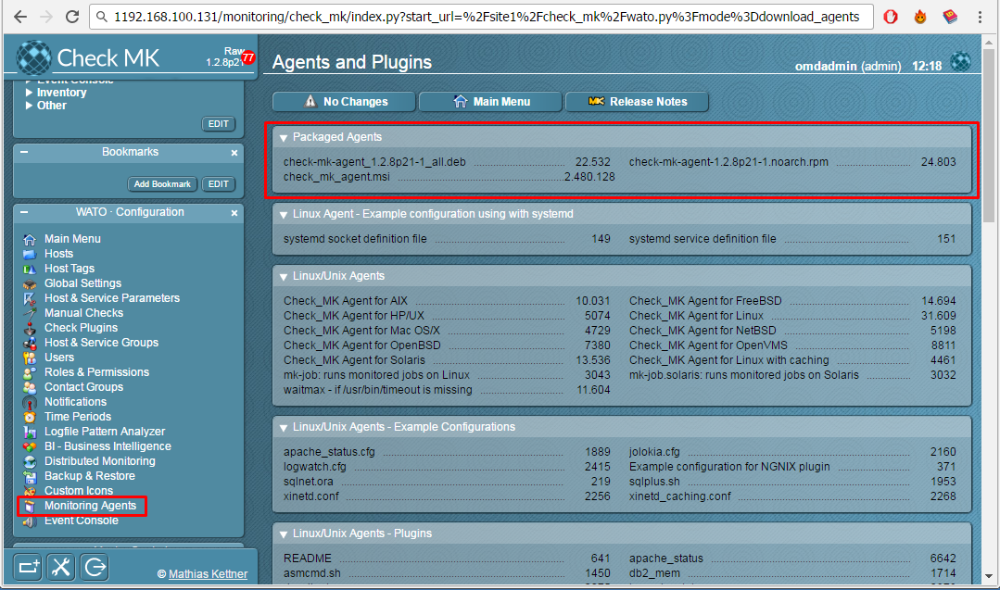

Ở đây, có 3 packet dành cho 3 DISTRO:

- *.deb: Dành cho các host sử dụng DEBIAN
- *.rpm: Dành cho các host sử dụng RHEL
- *.msi: Dành cho các host sử dụng MS Windows

<a name="1" ></a>
### Trên CentOS

Đầu tiên, tôi sẽ giám sát host CentOS 7. Vì thế tôi sẽ tải file `RPM`. Trên Host CentOS cần giám sát, chúng ta tải `agent` cho nó từ server. Để lấy link tải, chúng ta vào Web UI và chuột phải vào link, chọn **Copy link address** (Tiếng Việt: **Sao chép địa chỉ liên kết**)

<a name="copylink" ></a>
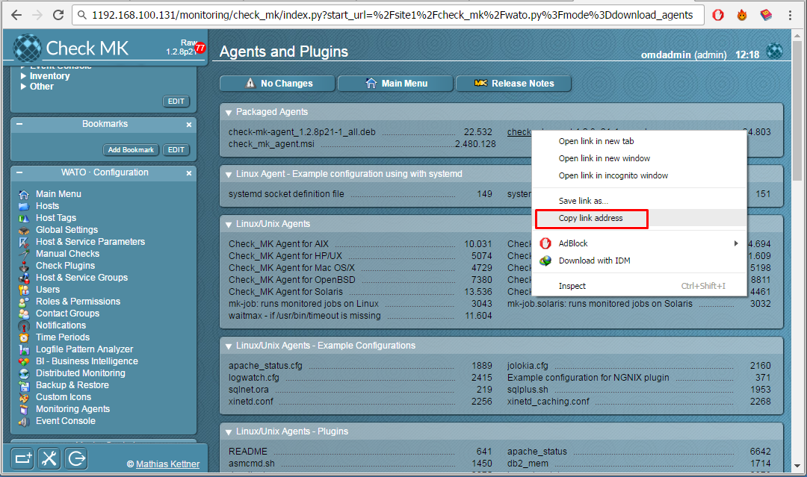

Và sau đó qua terminal của máy cần cài đặt và dùng `wget` để tải file

```
wget http://192.168.100.131/monitoring/check_mk/agents/check-mk-agent-1.2.8p21-1.noarch.rpm
```

**Lưu ý:** 
- Ở những phiên bản thấp hơn 1.2.8, khi dùng `wget` để tải agent OMD sẽ yêu cầu xác thực.
- Thay thế địa chỉ IP server vào câu lệnh trên.
- Link này được copy từ Web UI (Để câu lệnh thực hiện chính xác, vui lòng copy từ Web UI của bạn như bước [trên](#copylink).)

Kiểm tra `xinet.d` đã được cài đặt.

```
rpm -qa | grep xinetd
```


Nếu câu lệnh không trả về kết quả như hình, vui lòng cài đặt theo lệnh sau:

```
yum install xinetd -y
```

Khởi động dịch vụ và cho chạy cùng hệ thống:

```
systemctl start xinetd
systemctl enable xinetd
```

Cài đặt `agent` bằng lệnh

```
rpm -ivh check-mk-agent-*
```

Để cho phép OMD Server được truy cập vào host, chúng ta chỉnh sửa file cấu hình `agent` trên host

```
vi /etc/xinetd.d/check_mk
```

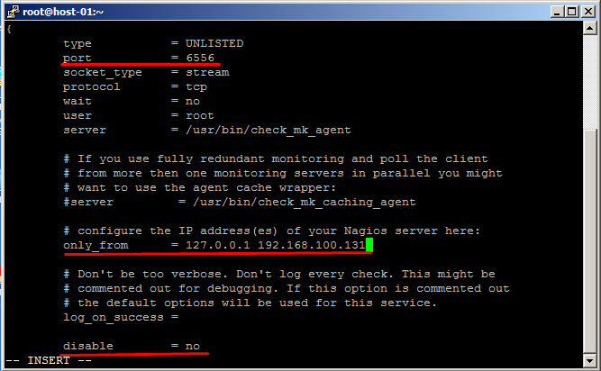

Có 3 thông số chúng ta cần phải chỉnh cho chính xác:

- port: 6556
- only_from: Thêm địa chỉ IP server OMD của bạn
- disable: no (Có nghĩa cho phép dịch vụ chạy)

Sau khi chỉnh xong, chúng ta lưu lại file và khởi động lại `xinetd`.

```
systemctl restart xinetd
```

Kiểm tra port đã hoạt động

```
netstat -npl | grep 6556
```

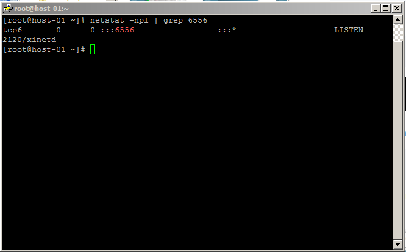

Nếu không có lệnh `netstat` vui lòng cài tiện ích `net-tools`:

```
yum install -y net-tools
```

- **Chú ý:** Nếu sử dụng Firewall vui lòng mở port 6556. Thực hiện các bước sau:

	- Với CentOS:
	
	```
	firewall-cmd --add-port=6556/tcp --permanent
	firewall-cmd --reload
	```
	
	Tắt SELINUX tức thời bằng lệnh:

	```
	setenforce 0
	```

	Chỉnh sửa file cấu hình của SELinux:

	```
	vi /etc/sysconfig/selinux
	```

	Sửa dòng `SELINUX=enforcing` thành `SELINUX=disabled`.

Sau khi cài thành công, chúng ta cấu hình trên [Web UI](#4).

<a name="2" ></a>
### Trên Ubuntu

Như phần hướng dẫn bên [trên](#1), chúng ta tải agent cho Ubuntu về host với lưu ý phần mở rộng của file là `*.deb`.

```
wget http://192.168.100.131/monitoring/check_mk/agents/check-mk-agent_1.2.8p21-1_all.deb
```

Cài đặt `agent` bằng lệnh

```
dpkg -i check-mk-agent-*
```

Để cho phép OMD Server được truy cập vào host, chúng ta chỉnh sửa file cấu hình `agent` trên host

```
vi /etc/xinetd.d/check_mk
```


Sau khi chỉnh xong, chúng ta lưu lại file và khởi động lại `xinetd`.

```
systemctl restart xinetd
```

Kiểm tra port đã hoạt động

```
netstat -npl | grep 6556
```


- **Chú ý:** Nếu sử dụng Firewall vui lòng mở port 6556. Thực hiện các bước sau:

	- Với Ubuntu:
	
	```
	ufw allow 5665/tcp
	ufw reload
	```
	
Tiếp đến, chúng ta sẽ quay lại [Web UI](#4) để cấu hình.

### Cài đặt trên Windows

Để cài đặt Agent trên Windows thực hiện theo các bước sau

- **Bước 1**: Tải gói cài đặt Agent:

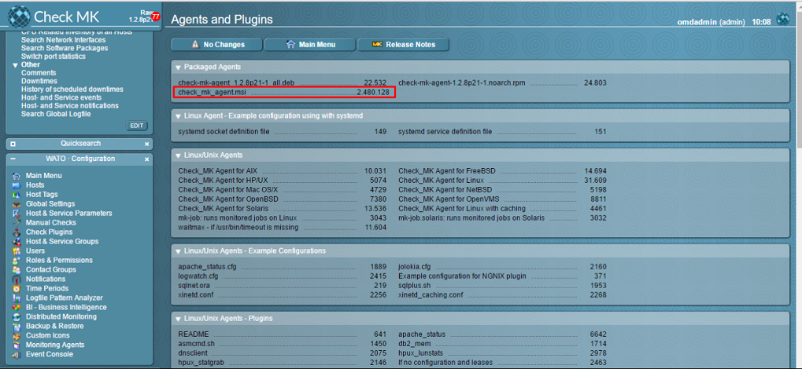

- **Bước 2**: Sau khi tải về, tiến hành cài đặt:

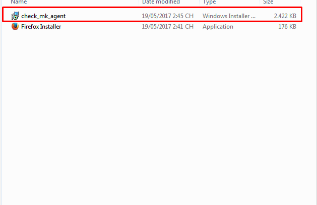

- **Bước 3**: Kiểm tra Service đã hoạt động chưa:

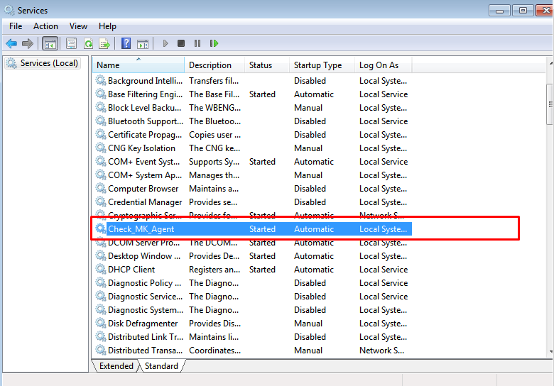

- **Bước 4**: Trong một số trường hợp, cần phải tạo Rule cho firewall với port `6556`

Mở CMD với quyền Administrator và thực hiện câu lệnh sau:

```
netsh advfirewall firewall add rule name="Check_MK Agent 6556 IN" dir=in action=allow protocol=TCP localport=6556
netsh advfirewall firewall add rule name="Check_MK Agent 6556 OUT" dir=out action=allow protocol=TCP localport=6556
```

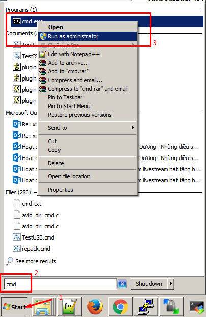

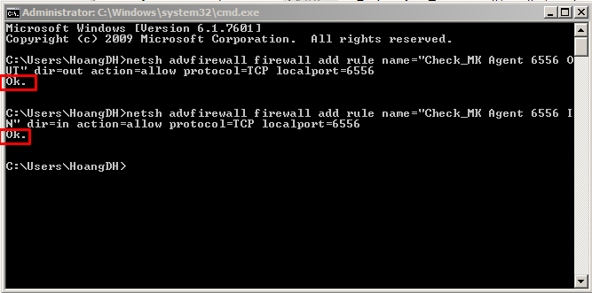


HOẶC có thể tham khảo cách sau: [Tạo rule cho Firewall bằng giao diện](https://github.com/meditechopen/mdt-ghichep-zabbix/blob/master/docs/Caidat-Zabbix.md#33)

- **Bước 5**: Add host trên dashboard

Đọc mục dưới đây để Add host từ Dashboard

<a name="4" ></a>
### Thêm host trên Web UI

Quay trở lại Web UI, chúng ta sẽ thêm mới 1 host. Đầu tiên, Vào Menu `WATO Configuration`, chọn `Hosts` và click vào `Create new host`

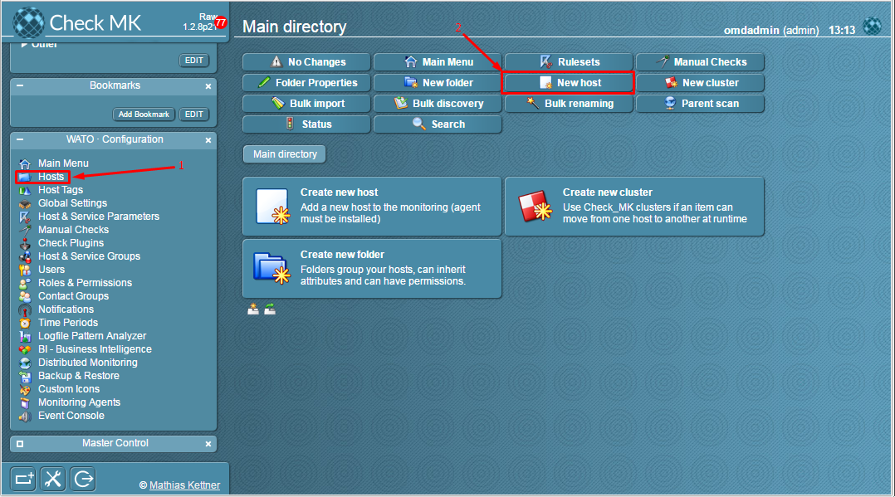

Điền thông tin của host của bạn như hình:

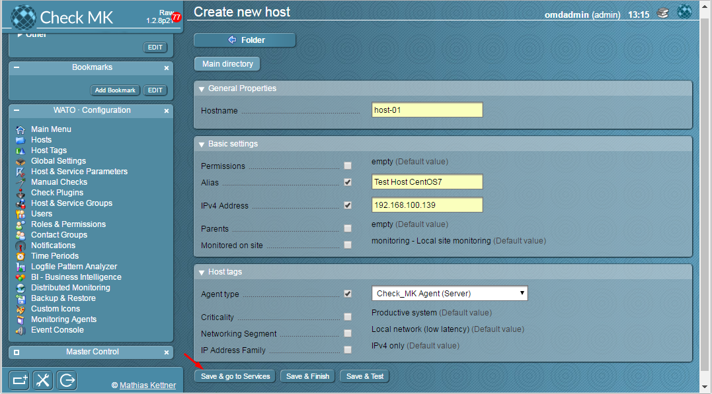

Click vào `Save & go to Services`, sau đó Server sẽ thu thập thông tin từ Agent cài trên host giám sát.

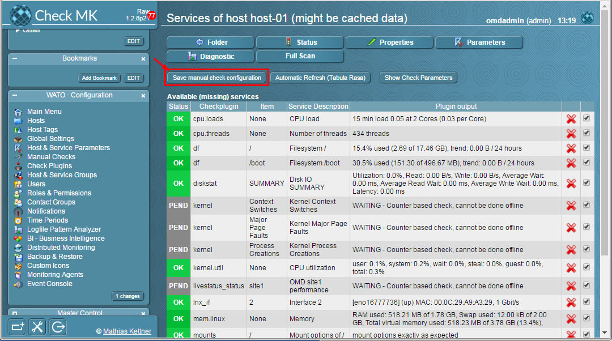

Click tiếp vào `Save manual check configuration` để lưu.

Một host mới đã được thêm, bấm vào ô màu cam `2 Changes` để active những thay đổi:

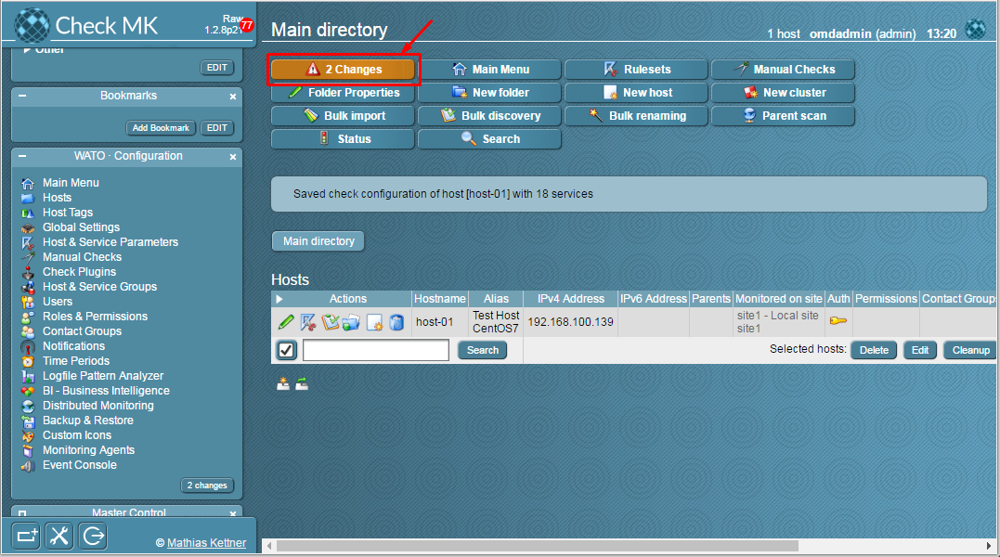
 
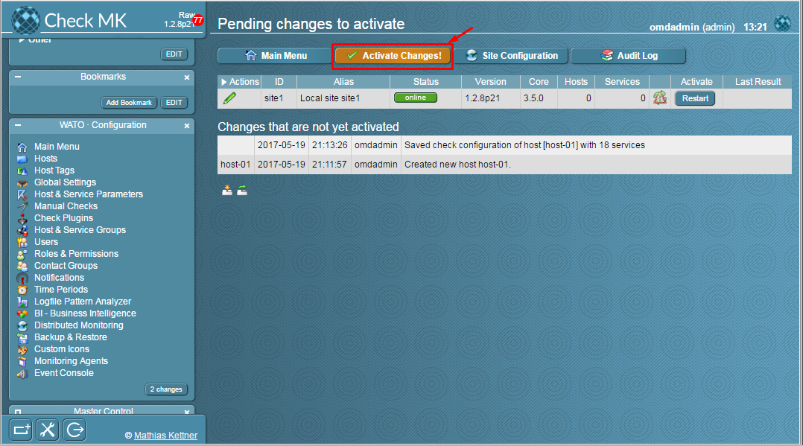

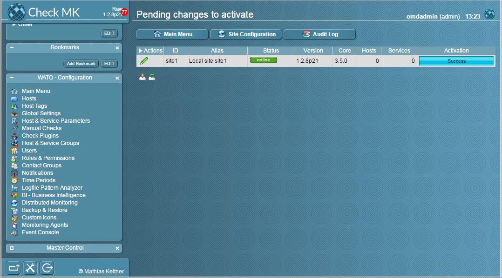

Các thay đổi được Appy thành công.

Tại Tab `View`, `Services` > `All Services`, click vào biểu tượng `Rerfesh` để force check dịch vụ:

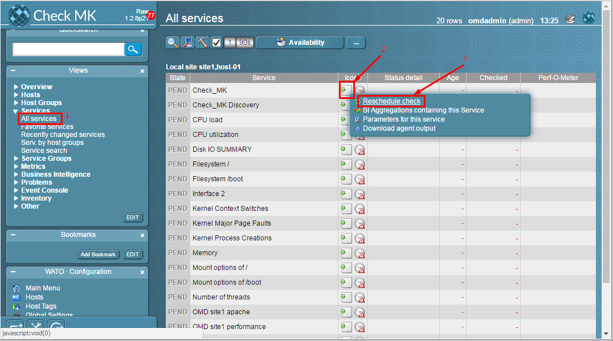

Hoặc đợi một vài phút, tất cả các dịch vụ đã được check và hiển thị thông tin lên Web UI

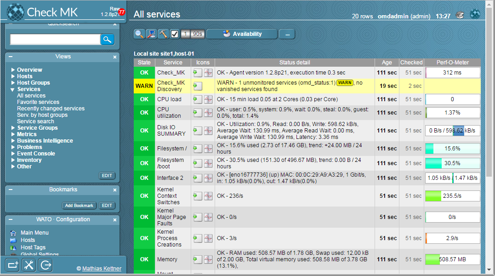

#### Lưu ý khi add host

- Khi thêm host trên Dashboard nếu gặp trường hợp không active được dịch vụ Check_MK_Discovery như sau:
Không active được dịch vụ `Check_MK_Discovery`

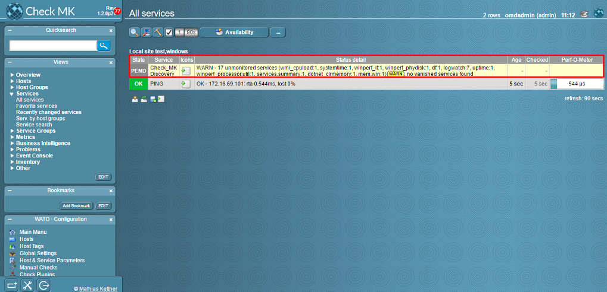

##### Ta phải làm như sau:

- **Bước 1**: Trên WATO chọn `host` sau đó chọn host vừa không active được dịch vụ `Check_MK_Discovery`:


- **Bước 2**: Chọn mục `Service`

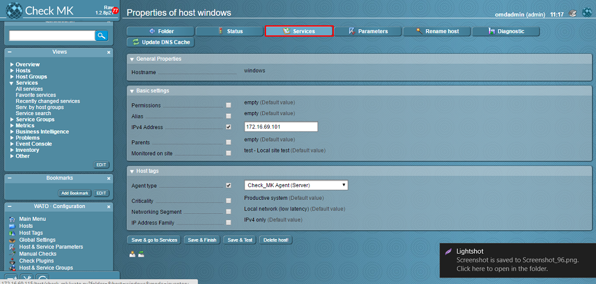

- **Bước 3**: Active các dịch vụ missing:

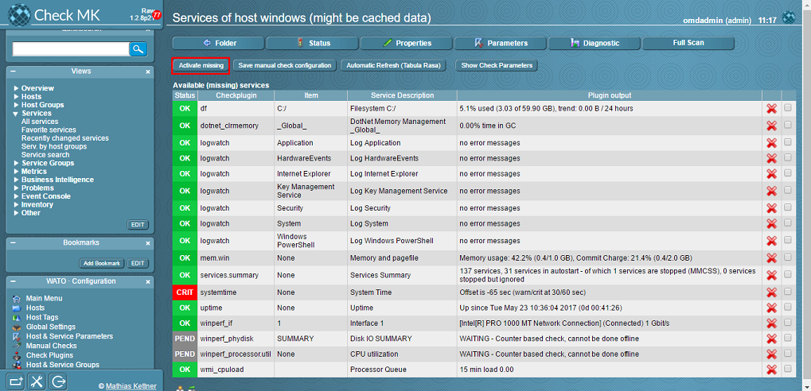

Sau đó kiểm tra trong mục Service

### Tham khảo các bài viết tiếp theo:

- [3. Cấu hình Active Check dịch vụ](3.Active-check.md)
- [4. Đặt ngưỡng cảnh báo cho dịch vụ](4.Set-threshold.md)
- [5. Cấu hình gửi mail cảnh báo sử dụng Gmail](5.Send-Noitify.md)
- [6. Thêm plugin vào OMD](6.Add-plugins.md)
- [7. Distributed Monitoring](7.Distributed.md)
- **Bonus:** [Quản lý các site trên OMD](Management-OMD.md)