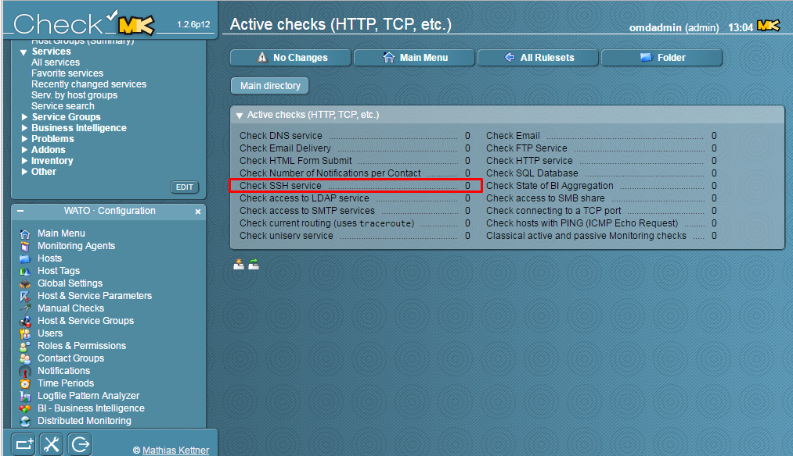
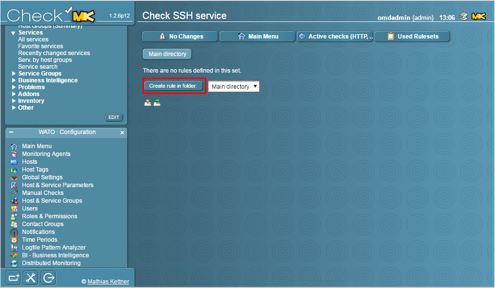
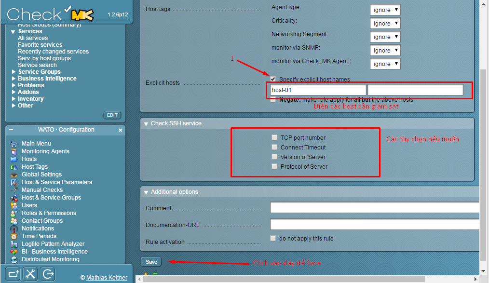
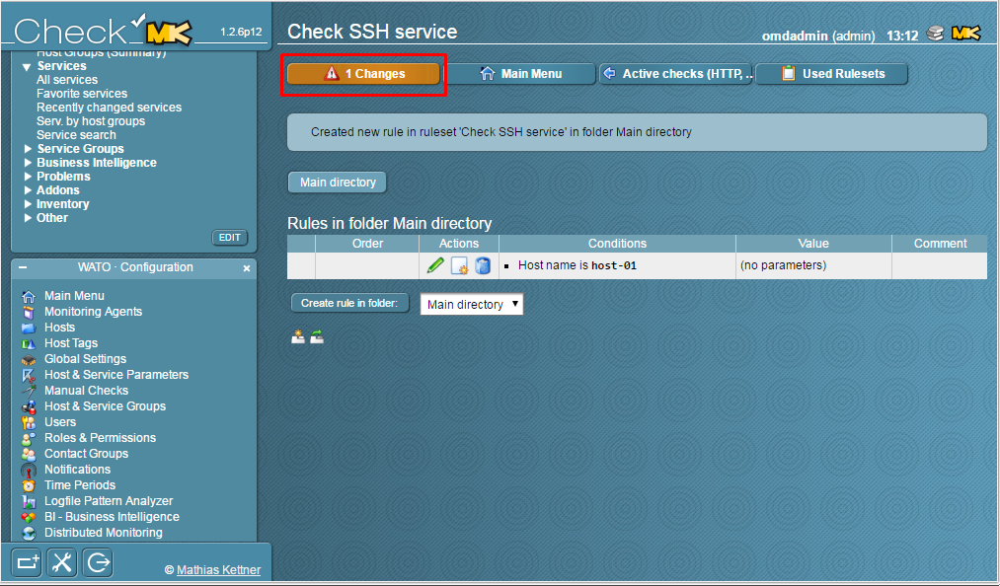
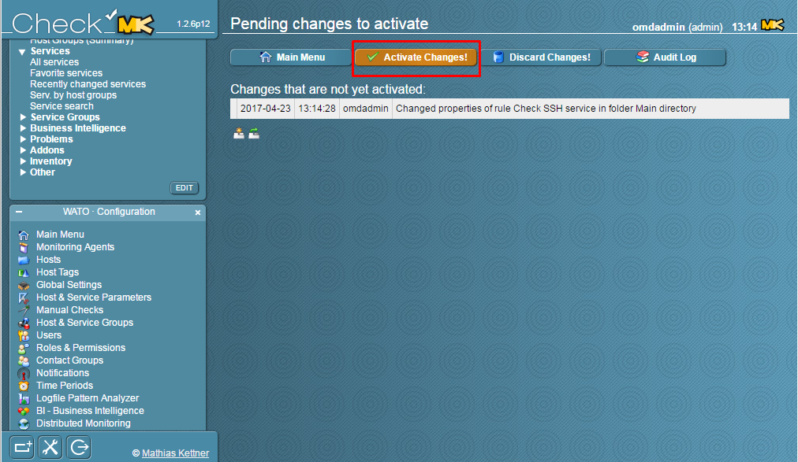
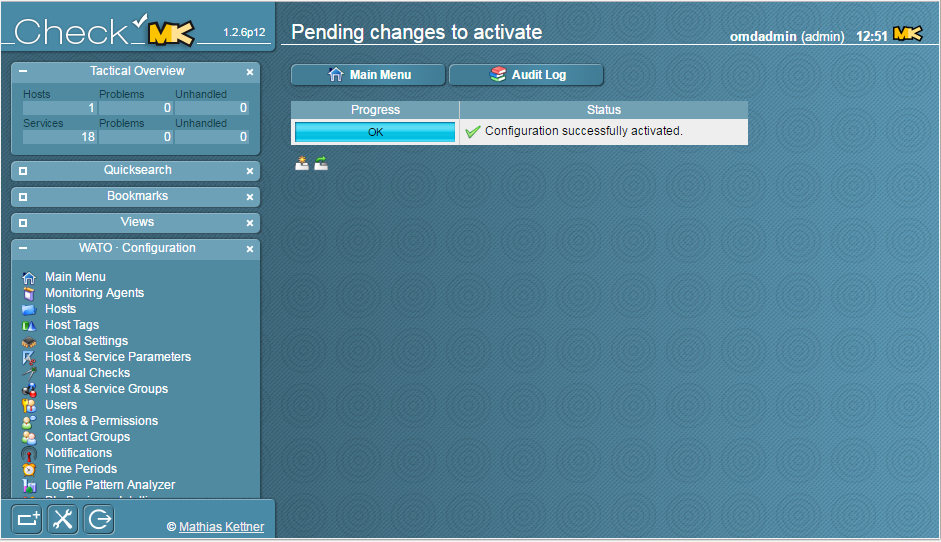
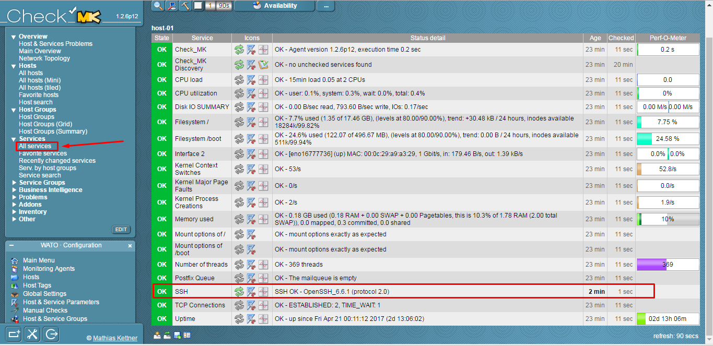

Trước khi thực hiện bước này, vui lòng tham khảo các bài viết trước đó: 

- [1. Hướng dẫn cài đặt](../README.md#1)
	- [Ubuntu 14.04](1.3.Setup-OMD-U14.04.md)
	- [Ubuntu 16.04](1.2.Setup-OMD-U16.04.md)
	- [CentOS 7](1.1.Setup-OMD-CentOS7.md)
- [2. Cài đặt Agent trên host cần giám sát](2.Install-agent.md)

### 3. Thêm dịch vụ giám sát Active Checks 

Trên Web UI, chúng ta tìm đến `WATO Configuration`, chọn `Host & Services Parameters`

Ở đây, có khá nhiều dịch vụ. Trong ví dụ này tôi chọn SSH.

Bấm vào `Create rule in folder:` để tạo 1 rule mới

Khai báo host cần giám sát, bấm save để lưu lại.

Lưu lại những thay đổi

Kiểm tra lại dịch vụ đã giám sát thành công:

Tại Tab `View`, `Services` > `All Services`

### Tham khảo các bài viết tiếp theo:

- [4. Đặt ngưỡng cảnh báo cho dịch vụ](4.Set-threshold.md)
- [5. Cấu hình gửi mail cảnh báo sử dụng Gmail](5.Send-Noitify.md)
- [6. Thêm plugin vào OMD](6.Add-plugins.md)
- [7. Distributed Monitoring](7.Distributed.md)
- **Bonus:** [Quản lý các site trên OMD](Management-OMD.md)