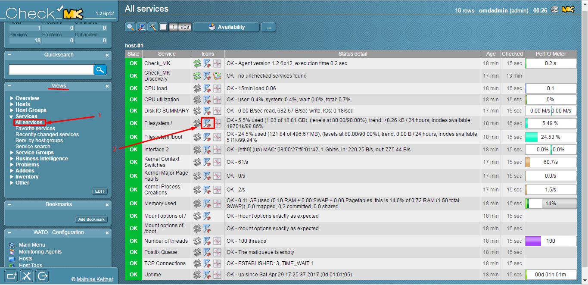
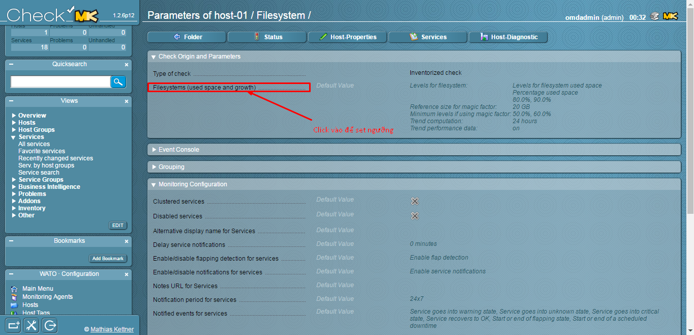
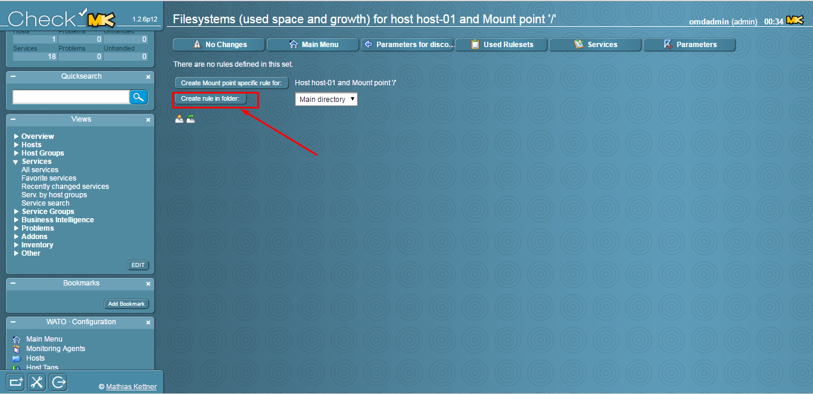
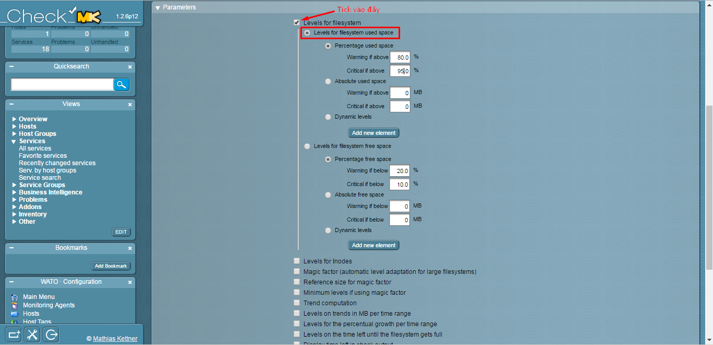
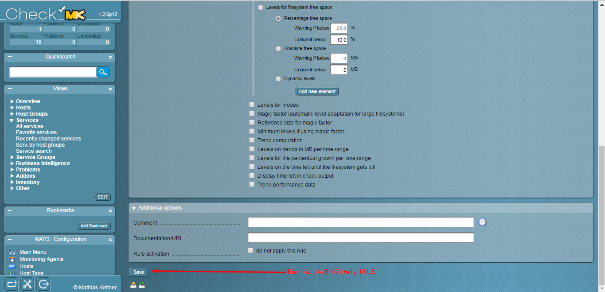
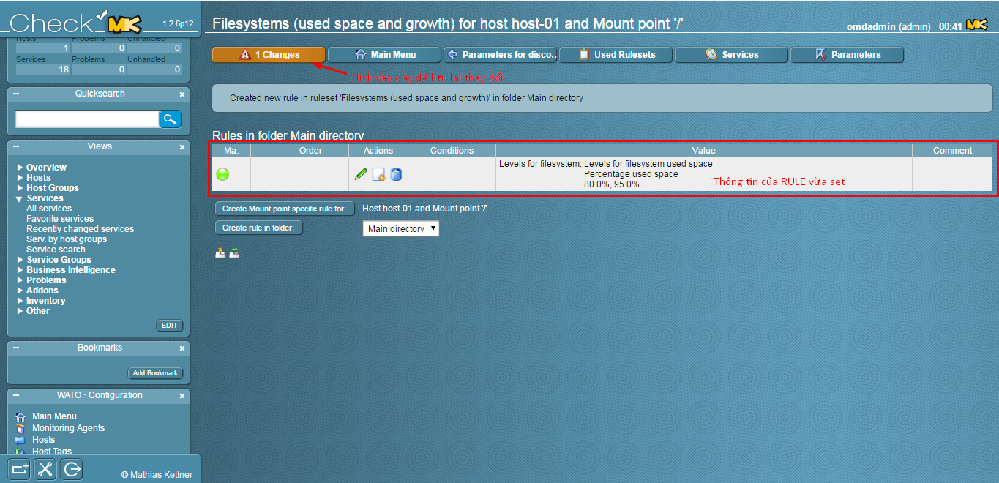
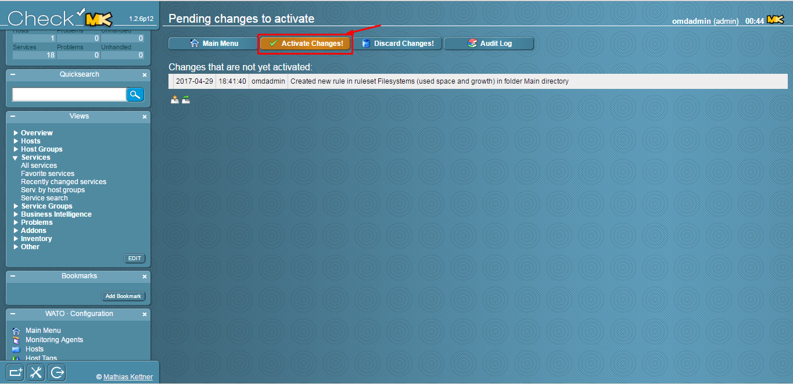
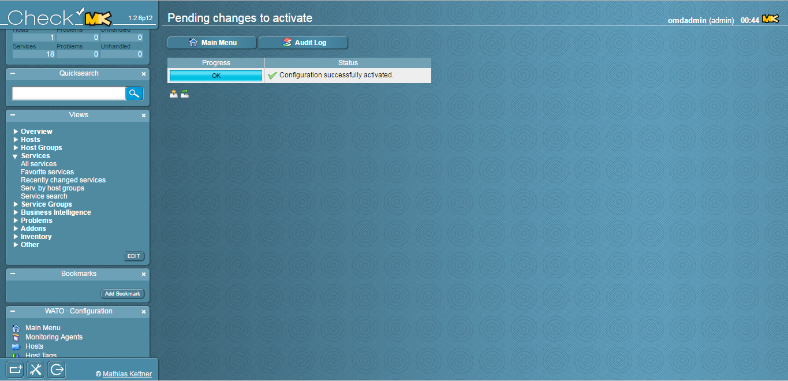

Trước khi thực hiện bước này, vui lòng tham khảo các bài viết trước đó: 

- [1. Hướng dẫn cài đặt](../README.md#1)
	- [Ubuntu 14.04](1.3.Setup-OMD-U14.04.md)
	- [Ubuntu 16.04](1.2.Setup-OMD-U16.04.md)
	- [CentOS 7](1.1.Setup-OMD-CentOS7.md)
- [2. Cài đặt Agent trên host cần giám sát](2.Install-agent.md)
- [3. Cấu hình Active Check dịch vụ](3.Active-check.md)

### 4. Đặt ngưỡng cảnh báo cho dịch vụ

Trên Web UI, chúng ta tìm đến **Views**, mở tab **Services** và chọn **All services**

Trong ví dụ này, tôi sẽ đặt ngưỡng cảnh báo khi thư mục `/` được sử dụng 80% dung lượng thì cảnh báo `Warning` và 95% dung lượng là `Critical`.

Đặt lại ngưỡng cảnh báo

Thêm một rule mới

Tìm đến **Parameters**, chúng ta sẽ đặt ngưỡng cho `/` ở đây

Kéo xuống bên dưới, click vào **SAVE** để lưu lại rule

Lưu lại những thay đổi

Sau khi đặt ngưỡng cảnh báo xong, bây giờ chúng ta sẽ đi đến phần cấu hình cho OMD có thể gửi mail cảnh báo khi host/services gặp sự cố hoặc vượt ngưỡng vừa set. *[Bài chi tiết](5.Send-Noitify.md)*

### Tham khảo các bài viết tiếp theo:

- [5. Cấu hình gửi mail cảnh báo sử dụng Gmail](5.1.Send-Noitify.md)
- [6. Thêm plugin vào OMD](6.Add-plugins.md)
- [7. Distributed Monitoring](7.Distributed.md)
- **Bonus:** [Quản lý các site trên OMD](Management-OMD.md)