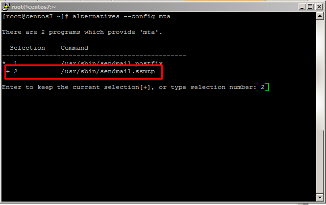
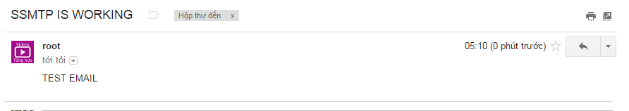

## Cấu hình sSMTP làm Mail Relay sử dụng Gmail


### 1. Cài đặt sSMTP

```
yum install -y epel-release
```

Sau khi cài gói epel, chúng ta chạy lệnh tiếp theo để cài đặt 2 gói chính trong bài hướng dẫn này là `ssmtp` và `mailx`.


```
yum install mailx ssmtp -y
```


### 2. Cấu hình sSMTP

Mặc định, Linux sử dụng postfix. Chúng ta sử dụng lệnh sau để chọn sSMTP.

- **Bước 1**: Sử dụng sSMTP

```
alternatives --config mta
```

Chọn số thứ tự tương ứng với */usr/sbin/sendmail.ssmtp*



- **Bước 2**: Tắt và vô hiệu hóa postfix

```
systemctl stop postfix
systemctl disable postfix
```

- **Bước 3**: Backup file cấu hình sSMTP

```
mv /etc/ssmtp/ssmtp.conf /etc/ssmtp/ssmtp.conf.bk
```

- **Bước 4**: Tạo file cấu hình mới

```
echo "root=postmaster
mailhub=mail
TLS_CA_File=/etc/pki/tls/certs/ca-bundle.crt
mailhub=smtp.gmail.com:587   # SMTP server for Gmail
Hostname=localhost
UseTLS=YES
UseSTARTTLS=Yes
FromLineOverride=YES #TO CHANGE FROM EMAIL
Root=root@localhost # Redirect root email
AuthUser=EMAIL@gmail.com
AuthPass=PASSWORD
AuthMethod=LOGIN
RewriteDomain=gmail.com" >> /etc/ssmtp/ssmtp.conf
```

- **Chú ý**:
	- `EMAIL@gmail.com`: Địa chỉ Gmail của bạn
	- `PASSWORD`: Mật khẩu của Gmail
	
- **Bước 5**: Cài đặt Gmail, cho phép truy cập bằng ứng dụng kém an toàn

Truy cập vào link https://myaccount.google.com/lesssecureapps?pli=1 để cài đặt tính năng này.

- **Bước 6**: Kiểm tra Mail relay

Chúng ta kiểm tra hoạt động của nó bằng cách gửi đi một email:

```
echo "TEST EMAIL" | mail -s "SSMTP IS WORKING" nobody@example.com
```
Lưu ý: Thay địa chỉ email của bạn vào câu lệnh.

Vào hộp thư của bạn kiểm tra email.

