## Hướng dẫn cấu hình gửi cảnh báo qua Slack trên OMD.

### Menu
- [1. Chuẩn bị](#1)
	- [1.1 Chuẩn bị Slack](#11)
		- [Tạo channel mới](#111)
		- [Lấy thông tin WebHooks](#112)
	- [1.2 Chuẩn bị Script](#12)
		- [Cài đặt gói Ruby](#121)
		- [Tải Script](#122)
		- [Chỉnh sửa thông tin trong Script](#123)
		- [Copy Script vào thư mục cấu hình](#124)
- [2. Cấu hình trên Web UI OMD](#2)
- [3. Kiểm tra hoạt động](#3)

 <a name="1"></a>
## 1. Chuẩn bị

 <a name="11"></a>
### 1.1 Chuẩn bị Slack

- **Bước 1:** Tạo channel mới  <a name="111"></a>

Đăng nhập vào Slack của bạn và bấm vào (+) để tạo một channel mới dùng để nhận thông báo từ OMD.


Điền thông tin của Channel

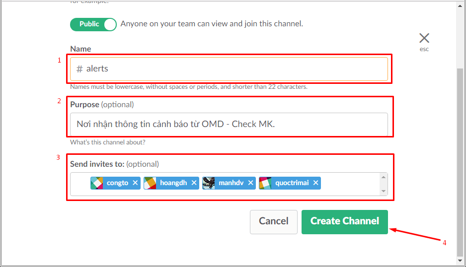

- **Giải thích**:
	- `1` Tên của Channel
	- `2` Phần mô tả channel
	- `3` Các thành viên của channel
	- `4` Bấm vào **Create Channel** hoàn tất.
	
- **Bước 2:** Lấy thông tin WebHooks  <a name="112"></a>

Truy cập vào đường dẫn sau để lấy thông tin Incomming WebHooks:

```
https://slack.com/apps/A0F7XDUAZ-incoming-webhooks
```

Bấm vào **Add configuration** để thêm cấu hình

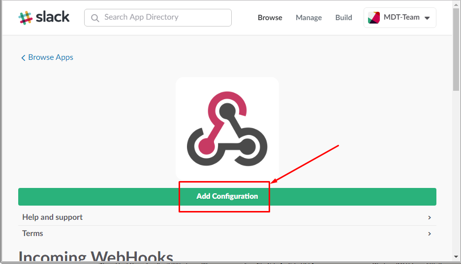

Chọn channel mà bạn vừa tạo, Channel của ví dụ của tôi là `alerts`.

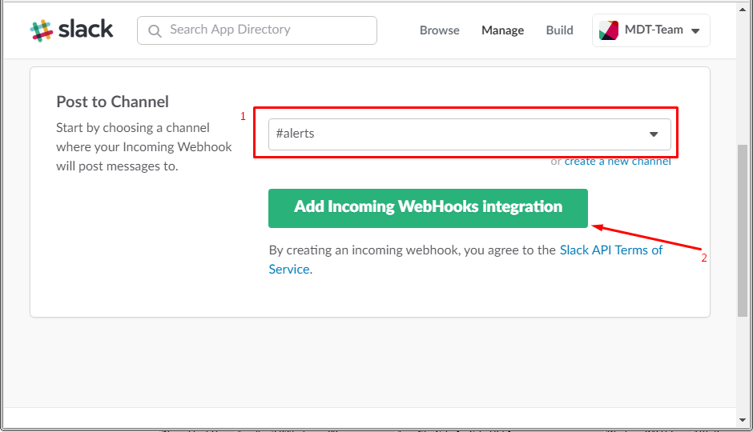

Kéo xuống tìm phần **Integration Settings** và copy địa chỉ WebHooks <a name="token"></a>

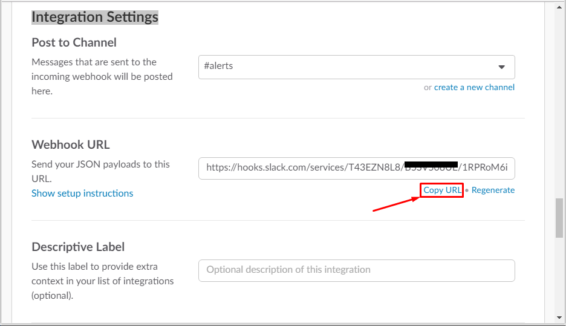

**Chú ý: Lưu lại địa chỉ WebHooks vào một bản nháp nào đó để bước sau sử dụng sửa vào file script.**

Và kéo xuống dưới để lưu lại thông tin:

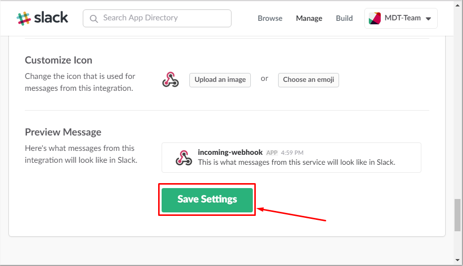

 <a name="12"></a>
### 1.2 Chuẩn bị Script

- **Bước 1:** Cài đặt gói Ruby <a name="121"></a>

Do script được viết bằng Ruby nên chúng ta cài `ruby` để script có thể hoạt động.

```
yum install -y ruby ruby-json
```

- **Bước 2:** Tải Script <a name="122"></a>

Tiếp theo, chúng ta tải script và phân quyền cho nó.

```
cd /opt
wget https://gist.githubusercontent.com/matmannion/57265df46e6b23485a07/raw/ba983e8c9614af73907ab0e657fa93f9a8a9408d/slack.rb
chmod +x slack.rb
```

- **Bước 3:** Chỉnh sửa thông tin trong Script  <a name="123"></a>

Chúng ta mở script và chỉnh sửa một vài thông tin chính sau:

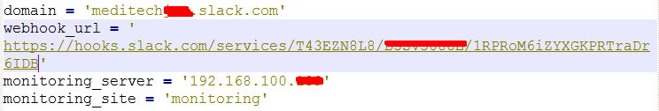

- Trong đó:
	- `domain`: Địa chỉ Slack của bạn.
	- `webhook_url`: Địa chỉ WebHooks mà bạn vừa tạo ở [bên trên](#token).
	- `monitoring_server`: Địa chỉ server OMD của bạn
	- `monitoring_site`: Tên site của bạn.

- **Bước 4:** Copy script vào thư mục cấu hình OMD <a name="124"></a>

```
cd /opt
cp slack.rb /opt/omd/versions/1.2.8p21.cre/share/check_mk/notifications
```

**Chú ý:** Thay thế phiên bản OMD mà bạn đang dùng vào câu lệnh. Bài hướng dẫn sử dụng phiên bản `1.2.8p21.cre`

Để xem phiên bản đang sử dụng, vui lòng chạy lệnh sau:

```
omd version
```

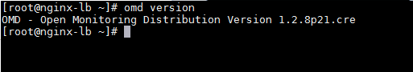

Như vậy, chúng ta đã cấu hình xong trên Slack. Chúng ta tiếp tục chuyển sang bước tiếp theo để cấu hình trên Web UI.

<a name="2"></a>
### 2. Cấu hình trên Web UI OMD

Đầu tiên, chúng ta vào **WATO - Configuration > Notifications > New Rule**:

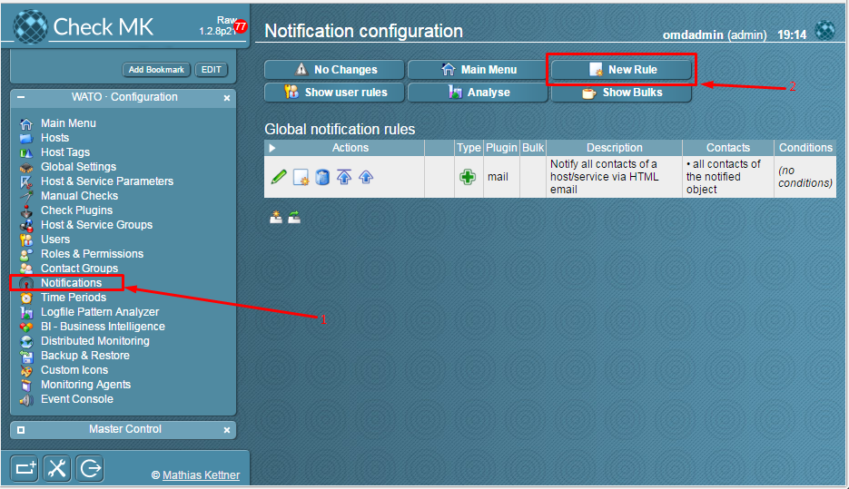

Điền thông tin và chọn **Notify by Slack**

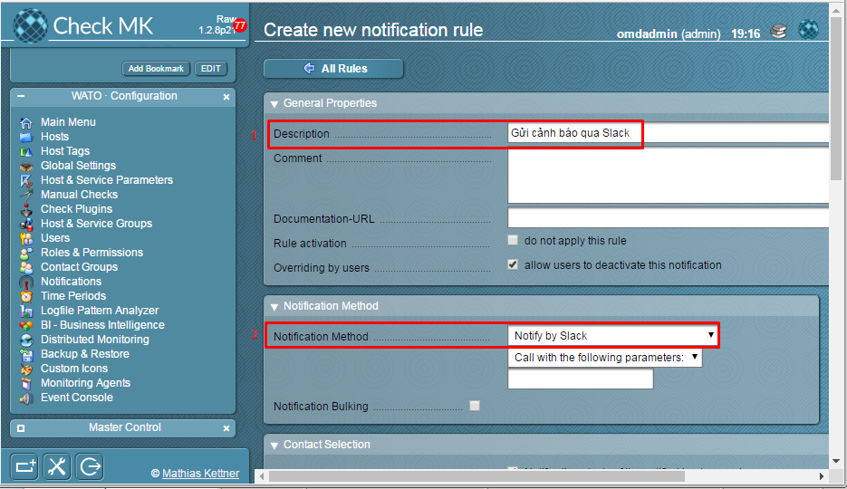

Bỏ tick và chọn một **User** bất kỳ có trên hệ thống

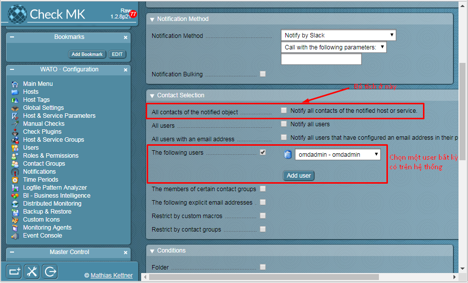

Kéo xuống và lưu lại thông tin:

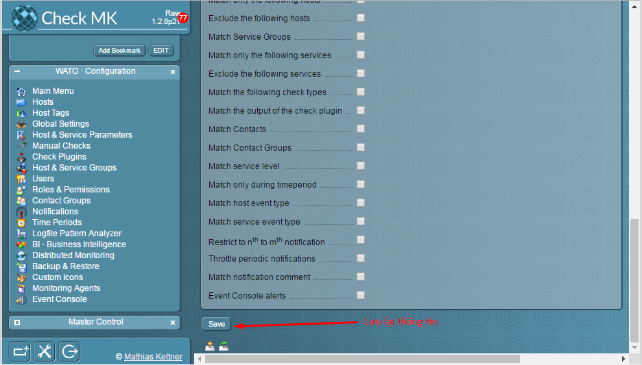

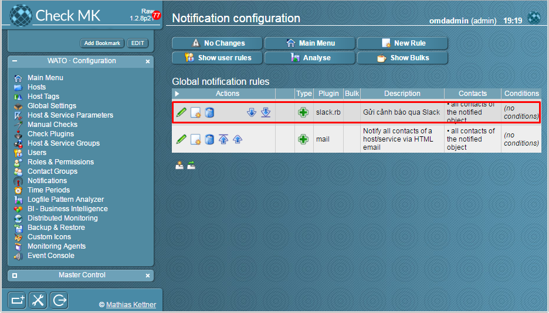

 <a name="3"></a>
### 3. Kiểm tra hoạt động

Chúng ta vào một dịch vụ bất kỳ và thử cảnh báo.

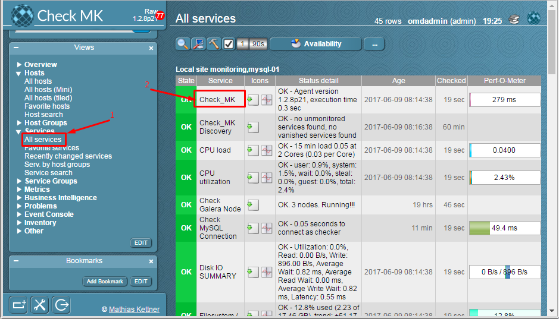

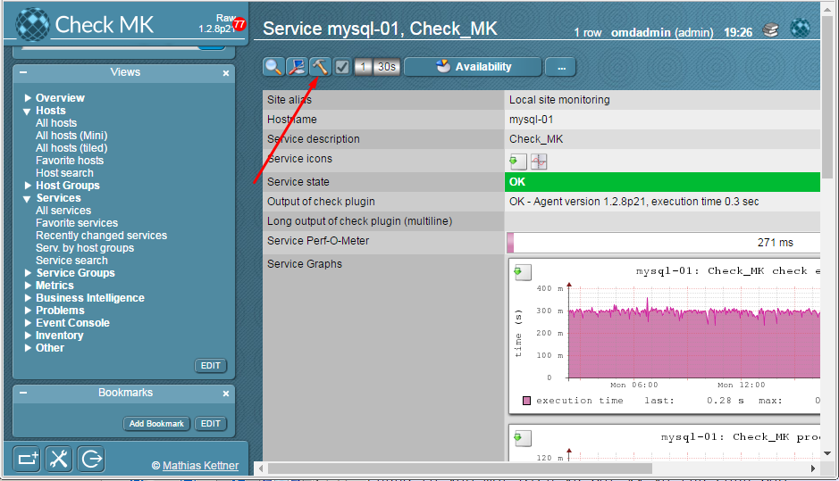

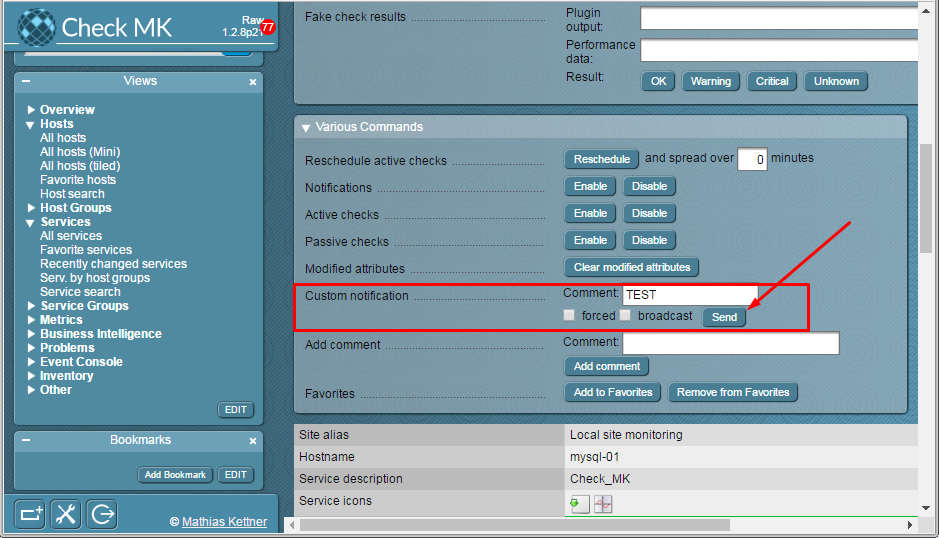

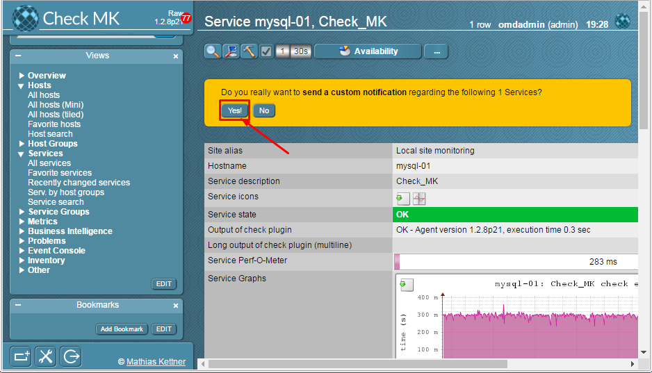

Kiểm tra trên Slack

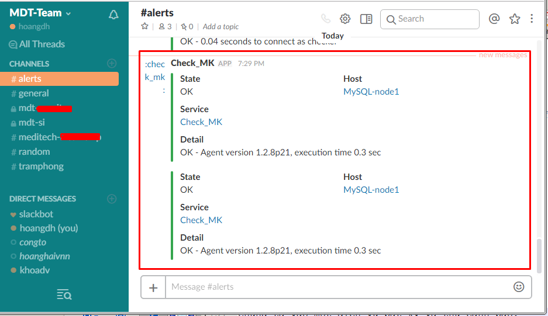