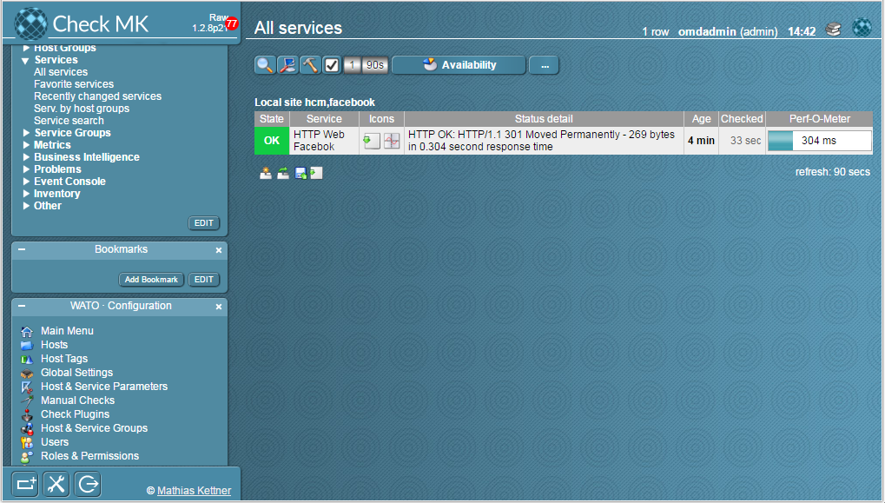
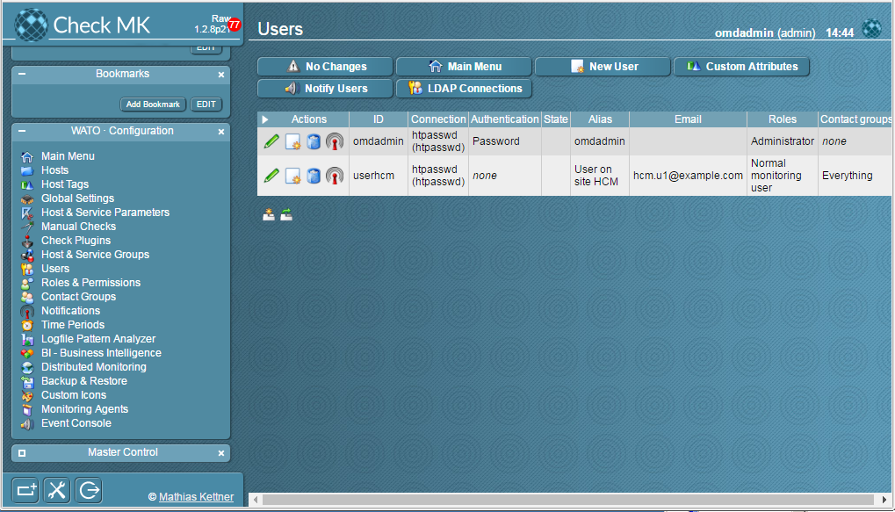

## Hướng dẫn cấu hình Distributed Monitoring

Trước khi thực hiện bước này, vui lòng tham khảo các bài viết trước đó: 

- [1. Hướng dẫn cài đặt](../README.md#1)
	- [Ubuntu 14.04](1.3.Setup-OMD-U14.04.md)
	- [Ubuntu 16.04](1.2.Setup-OMD-U16.04.md)
	- [CentOS 7](1.1.Setup-OMD-CentOS7.md)
- [2. Cài đặt Agent trên host cần giám sát](2.Install-agent.md)
- [3. Cấu hình Active Check dịch vụ](3.Active-check.md)
- [4. Đặt ngưỡng cảnh báo cho dịch vụ](4.Set-threshold.md)
- [5. Cấu hình gửi mail cảnh báo sử dụng Gmail](5.Send-Noitify.md)
- [6. Thêm plugin vào OMD](6.Add-plugins.md)

### Menu

- [1. Yêu cầu](#1)
- [2. Cấu hình Distributed Monitoring](#2)
	- [2.1 Chỉnh timezone trên các server](#21)
	- [2.2 Backup dữ liệu của site slave](#22)
	- [2.3 Cấu hình Distributed Monitoring trên slave](#23)
	- [2.4 Cấu hình trên server master](#24)
	- [2.5 Restore dữ liệu các site slave](#25)
- [3. Kiểm tra trên Master](#3)

<a name="1"></a>
### 1. Yêu cầu

Distributed Monitoring là giải pháp thực hiện việc giám sát tập trung kết quả nhiều của nhiều `site` trên một máy chủ. Thay vì phải vào từng site để theo dõi các host trên đó, chúng ta chỉ cần vào 1 site chính. Điều này vô cùng tiện lợi khi chúng ta có nhiều Data Center.

Để cấu hình được Distributed Monitoring, chúng ta cần thực hiện những yêu cầu tối thiểu sau.

- Các server đã cài đặt OMD - Check MK
- Cùng 1 timezone
- Backup dữ liệu trước khi cấu hình Distributed
 
#### Mô hình cài đặt


#### IP Planning


Điều kiện đầu tiên, chúng ta phải cài đặt OMD trên các server. Quay lại những [bài viết trước] để biết cách cài đặt OMD, thêm site, thêm dịch vụ giám sát,... Quy ước như sau, chúng ta gọi máy chủ `main` là *master* để quản lý, thu thập thông tin từ 2 máy *slave* chủ `site-hanoi` và `site-hcm`. 

<a name="2"></a>
### 2. Cấu hình Distributed Monitoring
<a name="21"></a>
#### 2.1 Chỉnh timezone trên các server

Trên tất cả các server, chúng ta đồng nhất một Timezone là **Asia/Ho_Chi_Minh**

```
timedatectl set-timezone Asia/Ho_Chi_Minh
timedatectl
```

Sau khi chỉnh xong, chúng ta kiểm tra lại.

Trên Server `main` - Master


Trên 2 Slave `site-hn` và `site-hcm`


<a name="22"></a>
#### 2.2 Backup dữ liệu của site slave

Ở bài hướng dẫn này, tôi đã theo dõi [Active check](3.Active-check.md) với YouTube trên `hanoi` và Facebook trên `hcm`. Và trên 2 site này, tôi cũng thêm 1 [user](5.Send-Noitify.md#22) tương ứng với các site là `user-hanoi` và `user-hcm`.

Thông tin trên site `hanoi`


Thông tin trên site `hcm`





Sau khi kiểm tra thông tin trên các slave, chúng ta backup lại thông tin theo các bước sau.

Đầu tiên là site `hanoi`, chúng ta tìm đến **WATO - Configuration**, **Backup & Restore**, **Create Snapshot**


Sau đó, tải bản backup (Snapshot) về máy tính của bạn. Chúng ta nhìn vào thông báo, và chọn đúng thời gian chúng ta backup.


Để backup ở `hcm`, chúng ta làm tương tự các bước trên. Sau khi hoàn thành, chúng ta có được 2 file snapshot và lưu ở máy tính.


<a name="23"></a>
#### 2.3 Cấu hình Distributed Monitoring trên slave

Sau khi backup (Snapshot) trên 2 site slave, chúng ta cấu hình Distributed Monitoring cho nó như sau:

Trên site `hanoi`, chúng ta mở Terminal và thực hiện các bước sau:

- **Bước 1**: Stop hoạt động của site

```
omd stop hanoi
```


- **Bước 2**: Cấu hình site

```
omd config hanoi
```

Chọn **Distributed Monitoring**


Chọn **LIVESTATUS_TCP** và **Change**


Chọn **on** và **Change**


- **Bước 3**: Start lại site


<a name="24"></a>
#### 2.4 Cấu hình trên server master


<a name="25"></a>
#### 2.5 Restore dữ liệu các site slave


<a name="3"></a>
### 3. Kiểm tra trên Master