## Hướng dẫn chi tiết giám sát RabbitMQ bằng OMD

Trước khi thực hiện bước này, vui lòng tham khảo các bài viết trước đó: 

- [1. Hướng dẫn cài đặt](../README.md#1)
	- [Ubuntu 14.04](1.3.Setup-OMD-U14.04.md)
	- [Ubuntu 16.04](1.2.Setup-OMD-U16.04.md)
	- [CentOS 7](1.1.Setup-OMD-CentOS7.md)
- [2. Cài đặt Agent trên host cần giám sát](2.Install-agent.md)
- [3. Cấu hình Active Check dịch vụ](3.Active-check.md)
- [4. Đặt ngưỡng cảnh báo cho dịch vụ](4.Set-threshold.md)
- [5. Cấu hình gửi mail cảnh báo sử dụng Gmail](5.Send-Noitify.md)
- [6. Thêm plugin vào OMD](6.Add-plugins.md)

Bài viết sẽ hướng dẫn lại cách [thêm plugin vào OMD](6.Add-plugins.md) với dịch vụ RabbitMQ.

### Các bước thực hiện như sau:

- [1. Chuẩn bị Plugin](#1)
	- [1.1 Chuẩn bị trên host RabbitMQ](1.1)
	- [1.2 Chuẩn bị trên server OMD](#1.2)
- [2. Cấu hình trên Web UI](#2)
- [3. Kiểm tra](#3)

<a name="1" ></a>
### 1. Chuẩn bị Plugin

<a name="1.1" ></a>
#### 1.1 Chuẩn bị trên host RabbitMQ

Thông tin host RabbitMQ

```
OS: CentOS 7
IP: 192.168.100.198
Hostname: node1
Service: RabbitMQ
```

Đầu tiên, chúng ta phải tạo một user có chức năng `monitoring` trên RabbitMQ.

```
rabbitmqctl add_user mon 1
rabbitmqctl set_user_tags mon monitoring
rabbitmqctl set_permissions -p / mon ".*" ".*" ".*" 
```

<a name="1.2" ></a>
#### 1.2 Chuẩn bị trên server OMD

- **Bước 1**: Cài đặt perl và gói `Monitoring::Plugins` trên OMD server

	- Trên server OMD sử dụng OS Ubuntu

	```sh
	curl -L http://cpanmin.us | perl - --sudo App::cpanminus
	perl -MCPAN -e 'install Monitoring::Plugin'
	perl -MCPAN -e 'install Config::Tiny'
	perl -MCPAN -e 'install JSON'
	perl -MCPAN -e 'install Math::Calc::Units'
	```
	**Lưu ý**: Khi lần đầu chạy lệnh trên, CPAN sẽ yêu cầu một số thiết lập, bấm Enter để nhập mặc định.

	- Trên server OMD sử dụng OS CentOS

	```sh
	yum install -y epel-release
	yum install -y perl-Monitoring-Plugin perl-Config-Tiny perl-JSON* perl-Math-Calc-Units
	```
	
- **Bước 2**: Cài đặt Plugin trên OMD
	- Tải plugin
	
	**Chú ý**: Thay thế `monitoring` bằng tên site của bạn.
	
	```
	git clone https://github.com/nagios-plugins-rabbitmq/nagios-plugins-rabbitmq.git
	cp nagios-plugins-rabbitmq/scripts/* /opt/omd/sites/monitoring/lib/nagios/plugins
	```
	
	- Phân quyền cho plugin
	
	```
	cd /opt/omd/sites/monitoring/lib/nagios/plugins
	chmod +x check_rabbitmq_*
	```

- **Bước 3:** Thêm thông tin host RabbitMQ trên OMD server

	Chúng ta thêm thông tin của RabbitMQ server trên file host của OMD bằng cách sửa file `/etc/hosts`.
	
	```
	vi /etc/hosts
	```

	```
	...
	192.168.100.198 node1
	```
	
	**Chú ý**: Thông tin `node1` phải trùng với hostname mà server RabbitMQ đang sử dụng.
	
- **Bước 4:** Chạy thử plugin để biết cách sử dụng hoặc [tham khảo](https://gist.github.com/hoangdh/c86dc9d081882ac116322b45399f0442)

	```
	cd /opt/omd/sites/monitoring/lib/nagios/plugins
	./check_rabbitmq_aliveness -H node1 -u mon -p 1
	```
	
	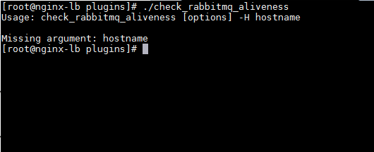
	
	Như vậy, ta thấy script chạy khá ổn. Tiếp đến chúng ta sẽ thêm vào `check_mk`.

<a name="2" ></a>
### 2. Cấu hình trên Web UI

Đầu tiên, chúng ta cài agent lên host RabbitMQ và thêm nó vào OMD theo [hướng dẫn](2.Install-agent.md#2-cài-đặt-agent-trên-host-giám-sát).

**Lưu ý**: Phần IP của host chúng ta điền `node1` vì đã khai báo ở phần trên trong file `hosts` như hình.

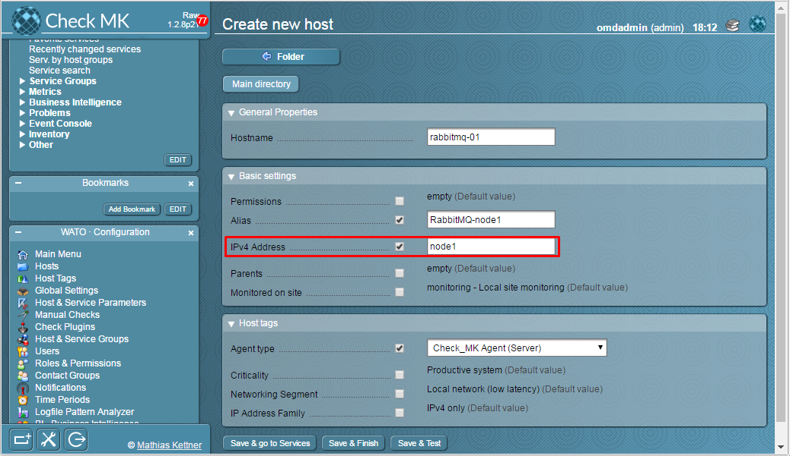

Trên Web UI, chúng ta tìm đến **WATO · Configuration** > **Host & Service Parameters** và chọn **Classical active and passive Monitoring checks**

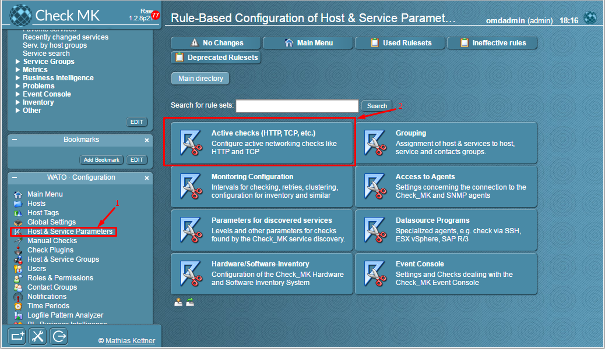

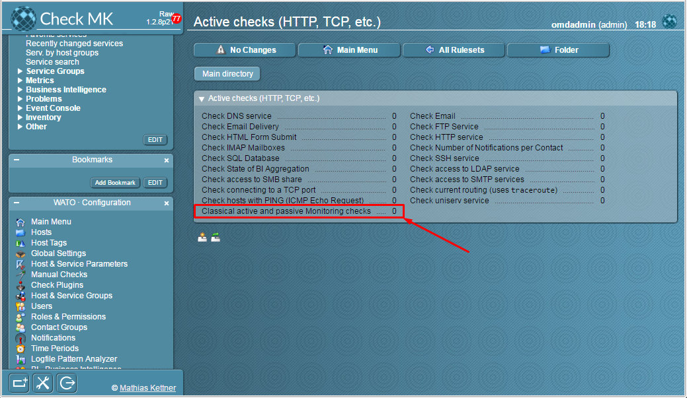

Bấm vào **Create rule in folder:** để tạo thêm 1 rule mới

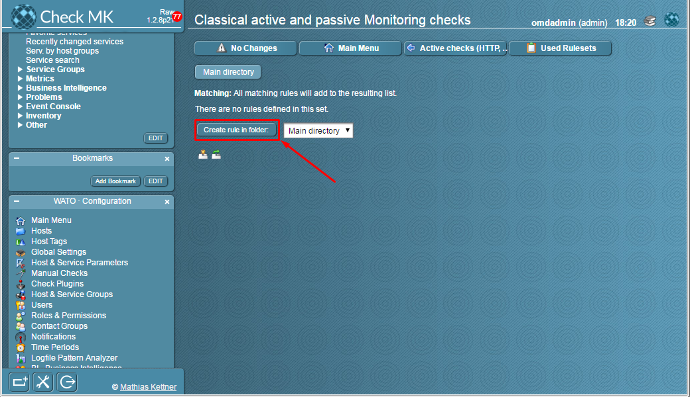

Điền thông tin của plugin:

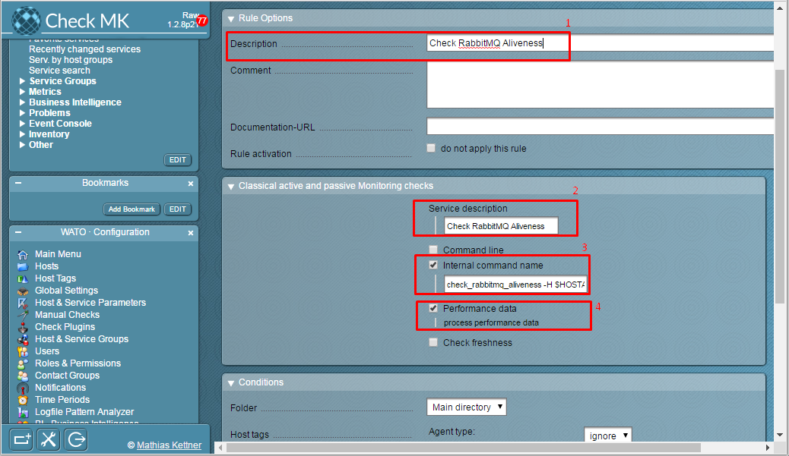

- **Giải thích:**
	- `1`: Mô tả plugin
	- `2`: Tên hiển thị của plugin
	- `3`: Câu lệnh sử dụng plugin. Biến **HOSTADDRESS** được sử dụng để gọi địa chỉ của host mà chúng ta khai báo ở bên trên là `node1`.
	```
	check_rabbitmq_aliveness -H **HOSTADDRESS** -u mon -p 1 --vhost / 
	```
	- `4`: Cho phép OMD xử lý, phân tích dữ liệu thu thập được.
	
Tiếp theo, chúng ta kéo xuống bên dưới và chọn host `rabbitmq-01` vừa thêm:
	
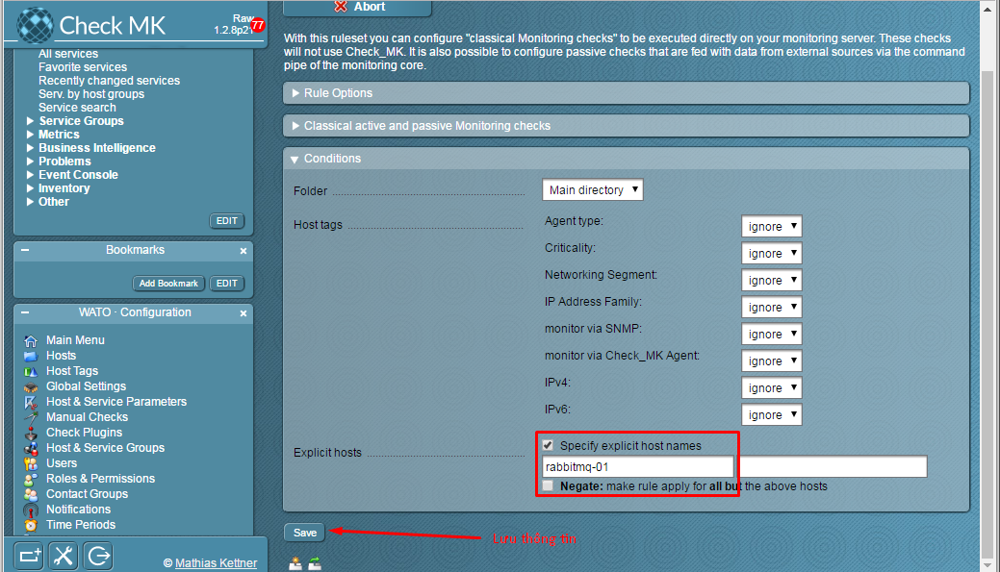

Lưu lại các thông tin vừa cấu hình:

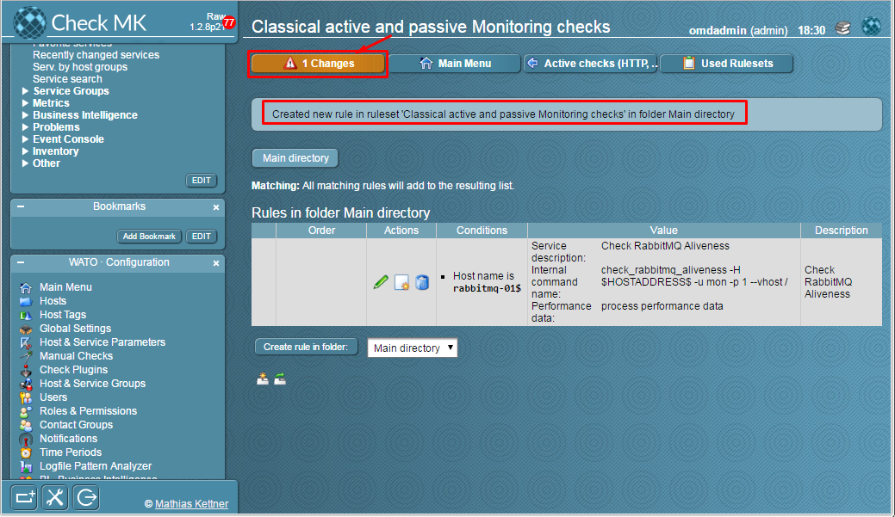

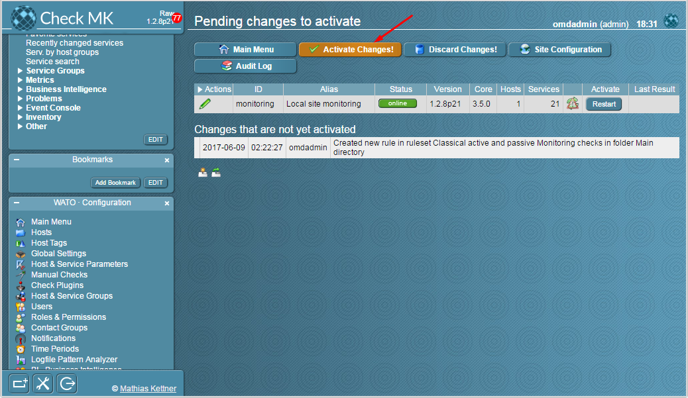

Kiểm tra thông tin, chúng ta chọn **Services > All services** trên tab **View** và chọn force check

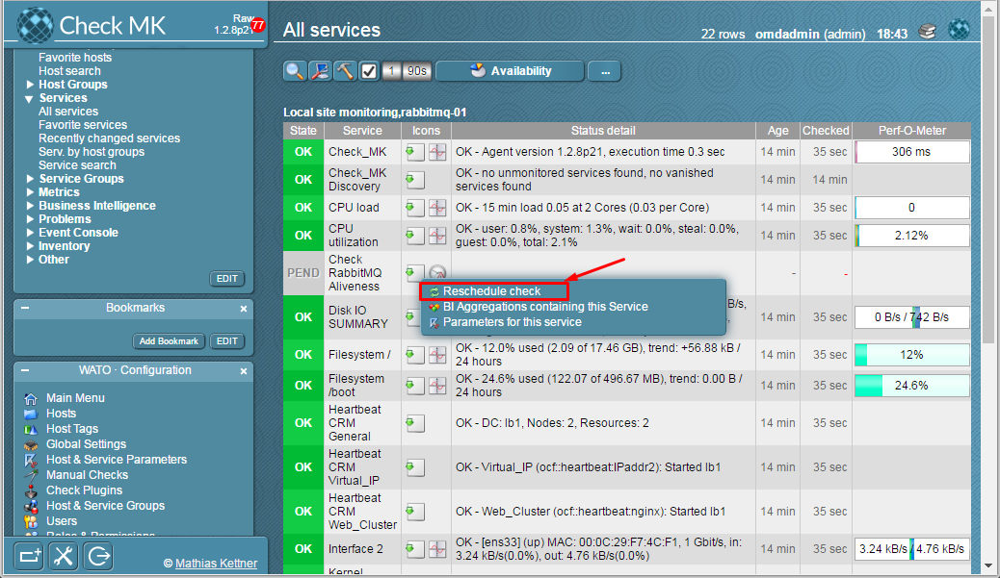

Như vậy, chúng ta đã giám sát thành công trạng thái Aliveness của server RabbitMQ.

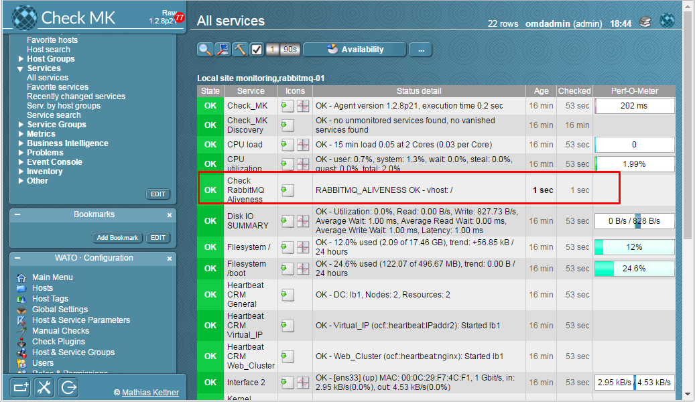

Để check các trạng thái khác của RabbitMQ, chúng ta thao tác như trên và thay thế câu lệnh ở bài viết [này](https://gist.github.com/hoangdh/c86dc9d081882ac116322b45399f0442).