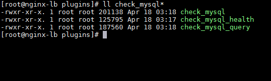
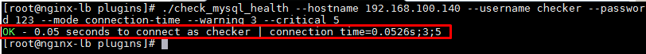
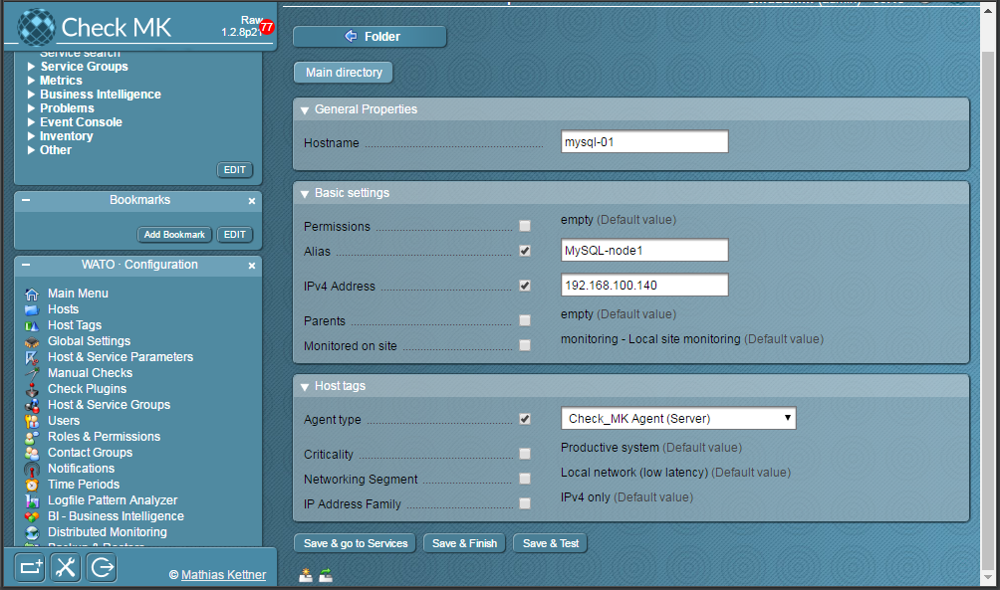
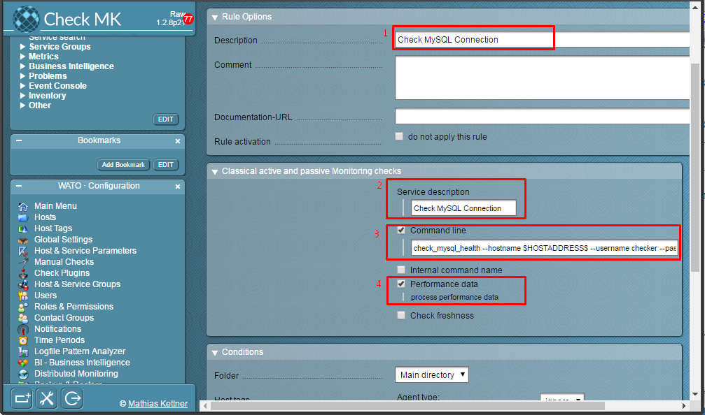
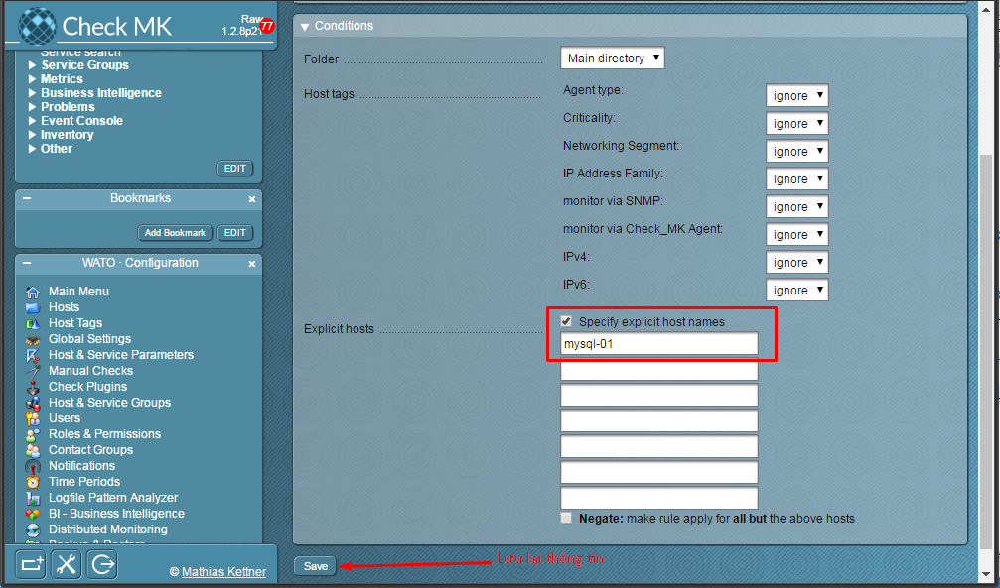
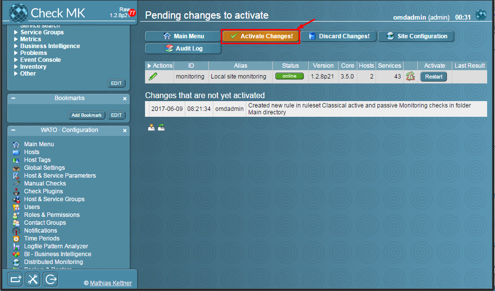
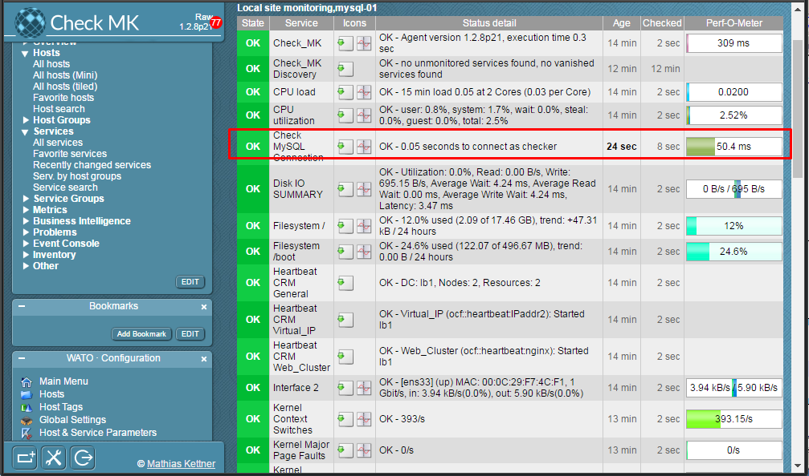

## Hướng dẫn chi tiết giám sát MySQL bằng OMD

Trước khi thực hiện bước này, vui lòng tham khảo các bài viết trước đó: 

- [1. Hướng dẫn cài đặt](../README.md#1)
	- [Ubuntu 14.04](1.3.Setup-OMD-U14.04.md)
	- [Ubuntu 16.04](1.2.Setup-OMD-U16.04.md)
	- [CentOS 7](1.1.Setup-OMD-CentOS7.md)
- [2. Cài đặt Agent trên host cần giám sát](2.Install-agent.md)
- [3. Cấu hình Active Check dịch vụ](3.Active-check.md)
- [4. Đặt ngưỡng cảnh báo cho dịch vụ](4.Set-threshold.md)
- [5. Cấu hình gửi mail cảnh báo sử dụng Gmail](5.Send-Noitify.md)
- [6. Thêm plugin vào OMD](6.Add-plugins.md)

Bài viết sẽ hướng dẫn lại cách [thêm plugin vào OMD](6.Add-plugins.md) với dịch vụ MySQL.

### Các bước thực hiện như sau:

- [1. Chuẩn bị Plugin](#1)
	- [1.1 Chuẩn bị trên host MySQL](1.1)
	- [1.2 Chuẩn bị trên server OMD](#1.2)
- [2. Cấu hình trên Web UI](#2)
- [3. Kiểm tra](#3)

<a name="1" ></a>
### 1. Chuẩn bị Plugin

<a name="1.1" ></a>
#### 1.1 Chuẩn bị trên host MySQL

Thông tin host MySQL

```
OS: CentOS 7
IP: 192.168.100.140
Hostname: node1
Service: MySQL
```

- **Bước 1:** Bind địa chỉ của server Database

Sửa file: `vi /etc/my.cnf` (Ubuntu) hoặc `vi /etc/my.cnf.d/server.cnf` (CentOS/RHEL) và thêm ở phần `[mysqld]`

```
...
[mysqld]
bind-address = 0.0.0.0
...
```

- **Bước 2:** Restart lại dịch vụ

```
systemctl restart mariadb
```

hoặc 

```
systemctl restart mysql
```

<a name="createuser" ></a>
- **Bước 3:** Tạo user kiểm tra cho OMD

Ở phần này chúng ta cần tạo một USER có quyền USAGE trên host DB (MySQL hoặc MariaDB).

Đăng nhập vào MySQL

```
mysql -u root -p
```

Thực hiện câu lệnh sau:

```
GRANT usage ON *.* TO 'checker'@'%' IDENTIFIED BY '123';
```

- `checker` : Tên của user dùng cho OMD có thể truy xuất vào DB (Tùy chọn)
- `123` : Mật khẩu của `checker` (Tùy chọn)

Như vậy là ta đã hoàn thành công việc ở host DB.

<a name="1.2" ></a>
#### 1.2 Chuẩn bị trên server OMD

- **Bước 1**: Cài đặt các gói đi kèm trên OMD server

	- Trên server OMD sử dụng OS CentOS

	Chúng ta thêm repo của MariaDB.
	
	```
	vi /etc/yum.repos.d/MariaDB.repo
	```

	```
	[mariadb]
	name = MariaDB
	baseurl = http://yum.mariadb.org/10.1/centos7-amd64
	gpgkey=https://yum.mariadb.org/RPM-GPG-KEY-MariaDB
	gpgcheck=1
	```
	
	Cài gói MariaDB-client và DBI, DBD::mysql

	```
	yum install MariaDB-client perl-DBI perl-DBD-MySQL -y
	```
	
- **Bước 2**: Cài đặt Plugin trên OMD
	- Kiểm tra plugin
	
	**Chú ý**: Thay thế `monitoring` bằng tên site của bạn.
	
	Kiểm tra plugin `check_mysql_health` trong thư mục chứa plugin của OMD. Vì plugin này đã tích hợp sẵn vào OMD.
	
	```
	cd /opt/omd/sites/monitoring/lib/nagios/plugins
	ll check_mysql*
	```
	
	
	
	Nếu chưa có hoặc thiếu, chúng ta tải và thêm vào OMD theo bước sau
	
	```
	wget https://raw.githubusercontent.com/hoangdh/meditech-ghichep-omd/master/tools/check_mysql_health
	cp check_mysql_health /opt/omd/sites/monitoring/lib/nagios/plugins
	```
	
	- Phân quyền cho plugin
	
	```
	cd /opt/omd/sites/monitoring/lib/nagios/plugins
	chmod +x check_mysql_health
	```
	
- **Bước 3:** Chạy thử plugin để biết cách sử dụng hoặc [tham khảo](https://gist.github.com/hoangdh/c5aab8dc05dca9710d3b98a782251352).

	```
	cd /opt/omd/sites/monitoring/lib/nagios/plugins
	./check_mysql_health --hostname 192.168.100.140 --username checker --password 123 --mode connection-time --warning 3 --critical 5
	```
	**Chú ý**: Thay thế user và password của bạn vào câu lệnh nếu có thay đổi thông tin ở bước [tạo user](createuser).
	
	
	
	Như vậy, ta thấy script chạy khá ổn. Tiếp đến chúng ta sẽ thêm vào `check_mk`.

<a name="2" ></a>
### 2. Cấu hình trên Web UI

Đầu tiên, chúng ta cài agent lên host DB - MySQL và thêm nó vào OMD theo [hướng dẫn](2.Install-agent.md#2-cài-đặt-agent-trên-host-giám-sát).

Thông tin như hình:



Trên Web UI, chúng ta tìm đến **WATO · Configuration** > **Host & Service Parameters** và chọn **Classical active and passive Monitoring checks**


Bấm vào **Create rule in folder:** để tạo thêm 1 rule mới


Điền thông tin của plugin:



- **Giải thích:**
	- `1`: Mô tả plugin
	- `2`: Tên hiển thị của plugin
	- `3`: Câu lệnh sử dụng plugin. Biến **HOSTADDRESS** được sử dụng để gọi địa chỉ của host mà chúng ta khai báo ở bên trên là IP `192.168.100.140`.
	```
	check_mysql_health --hostname $HOSTADDRESS$ --username checker --password 123 --mode connection-time --warning 3 --critical 5 
	```
	- `4`: Cho phép OMD xử lý, phân tích dữ liệu thu thập được.
	
Tiếp theo, chúng ta kéo xuống bên dưới và chọn host `mysql-01` vừa thêm:
	


Lưu lại các thông tin vừa cấu hình:




Kiểm tra thông tin, chúng ta chọn **Services > All services** trên tab **View** và chọn force check


Như vậy, chúng ta đã giám sát thành công MODE `connection-time` của server MySQL.



Để check thêm các MODE khác trong plugin với MySQL, chúng ta thao tác như trên và thay thế câu lệnh ở bài viết [này](https://gist.github.com/hoangdh/c5aab8dc05dca9710d3b98a782251352), xem file [excel](https://goo.gl/shx5jx) để biết thông tin các MODE.