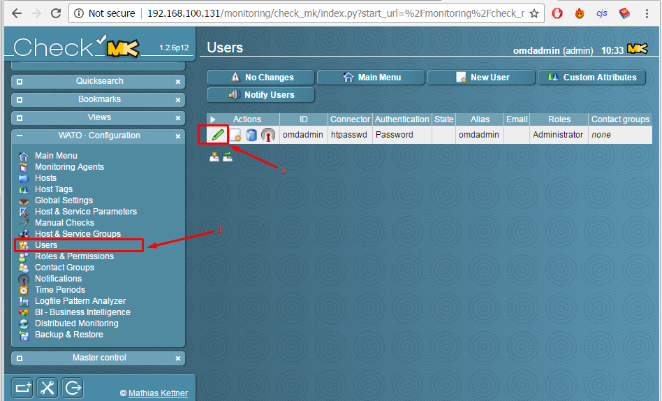
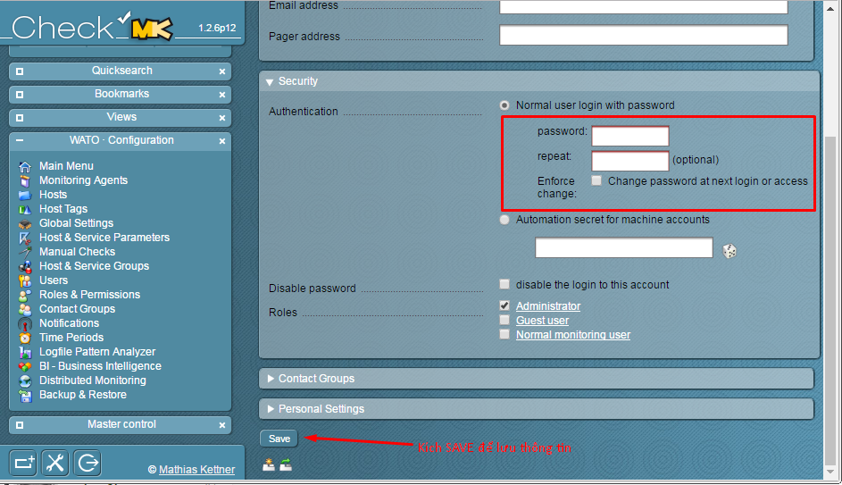

## Quản lý site trên OMD

### Menu

- [1. Giới thiệu](#1)
- [2. Đổi mật khẩu mặc định cho `omdadmin`](#2)
- [3. Thêm site mới](#3)
- [4. Cấu hình site](#4)
- [5. Khởi động site](#5)
- [6. Xem trạng thái của site](#6)
- [7. Xóa site](#7)

<a name="1" ></a>
### 1. Giới thiệu

OMD sử dụng lệnh `omd <option>`
Trong đó, các `option` được liệt kê ra như sau:

```
omd help
```

```
omd help                               Show general help
omd setup                              Prepare operating system for OMD (installs packages)
omd uninstall                          Remove OMD and all sites!
omd setversion VERSION                 Sets the default version of OMD which will be used by new sites
omd version    [SITE]                  Show version of OMD
omd versions                           List installed OMD versions
omd sites                              Show list of sites
omd create     SITE                    Create a new site (-u UID, -g GID)
omd init       SITE                    Populate site directory with default files and enable the site
omd rm         SITE                    Remove a site (and its data)
omd disable    SITE                    Disable a site (stop it, unmount tmpfs, remove Apache hook)
omd enable     SITE                    Enable a site (reenable a formerly disabled site)
omd mv         SITE NEWNAME            Rename a site
omd cp         SITE NEWNAME            Make a copy of a site
omd update     SITE                    Update site to other version of OMD
omd start      [SITE] [SERVICE]        Start services of one or all sites
omd stop       [SITE] [SERVICE]        Stop services of site(s)
omd restart    [SITE] [SERVICE]        Restart services of site(s)
omd reload     [SITE] [SERVICE]        Reload services of site(s)
omd status     [SITE] [SERVICE]        Show status of services of site(s)
omd config     SITE ...                Show and set site configuration parameters
omd diff       SITE ([RELBASE])        Shows differences compared to the original version files
omd su         SITE                    Run a shell as a site-user
omd umount     [SITE]                  Umount ramdisk volumes of site(s)
omd backup     SITE SITE [-|ARCHIVE_PATH] Create a backup tarball of a site, writing it to a file or stdout
omd restore    [SITE] [-|ARCHIVE_PATH] Restores the backup of a site to an existing site or creates a new site
```
<a name="2" ></a>
### 2. Thêm site mới

Trước khi sử dụng, chúng ta phải khai báo một `site`:

```
omd create monitoring
```


Như vậy một site có tên là `monitoring` đã được tạo ra và phần thông tin được tô đỏ trong hình. Mặc định, username được cấp là `omdadmin` và password là `omd`.

**Chú ý:** Có thể tạo nhiều `site` và tên được chọn tùy ý.

<a name="3" ></a>
### 3. Cấu hình site

```
omd config monitoring
```


- Trong đó:
	- `Basic`: Cấu hình core của OMD
	
	
	
	- `Web UI`
	
	
	
	- `Addons`
	
	
	
	- `Distributed Monitoring`
	
	

<a name="4" ></a>
### 4. Khởi động site

Sau khi tạo xong `site`, chúng ta kích hoạt site đó và đăng nhập thử trên Web UI.

#### Kích hoạt `site`
    
```
omd start monitoring
```


#### Truy cập vào Web UI và đăng nhập bằng `omdadmin/omd`
   
```
http://địa-chỉ-ip/monitoring
```


   
#### Chọn giao diện `Check_MK`
   


Sau khi chọn xong, chúng ta sẽ thấy một giao diện khá hoàn hảo với đầy đủ những chức năng cần thiết.


<a name="5" ></a>
### 5. Xem trạng thái của site

```
omd status monitoring
```


<a name="6" ></a>
### 6. Đổi mật khẩu mặc định cho `omdadmin`

Mặc định, user và password được cấp cho `site` mới là `omdadmin/omd`. Để đảm bảo tính an toàn, chúng ta thay đổi bằng cách:

Vào Menu, trong `WATO - Configuration`, chọn `User` (1), chọn tiếp chỉnh sửa (2)



Kéo xuống phần `Security` và thay đổi thông tin



Sau đó bấm `SAVE` để lưu lại thông tin.

<a name="7" ></a>
### 7. Tắt hoạt động của site

```
omd stop monitoring
```


<a name="8" ></a>
### 8. Xóa site

```
omd rm monitoring
```

Gõ `YES` để đồng ý xóa site.


