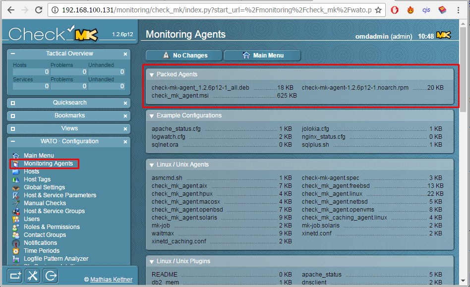
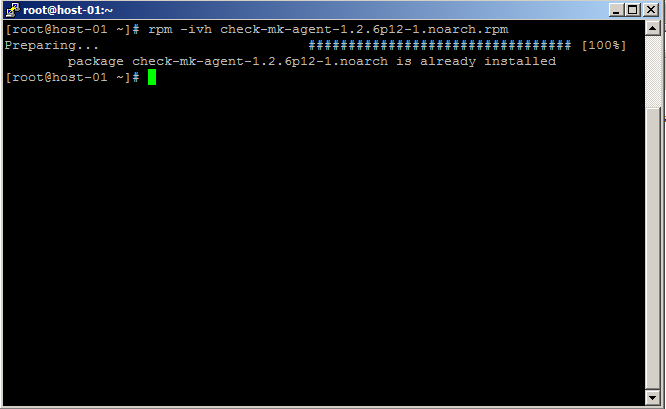
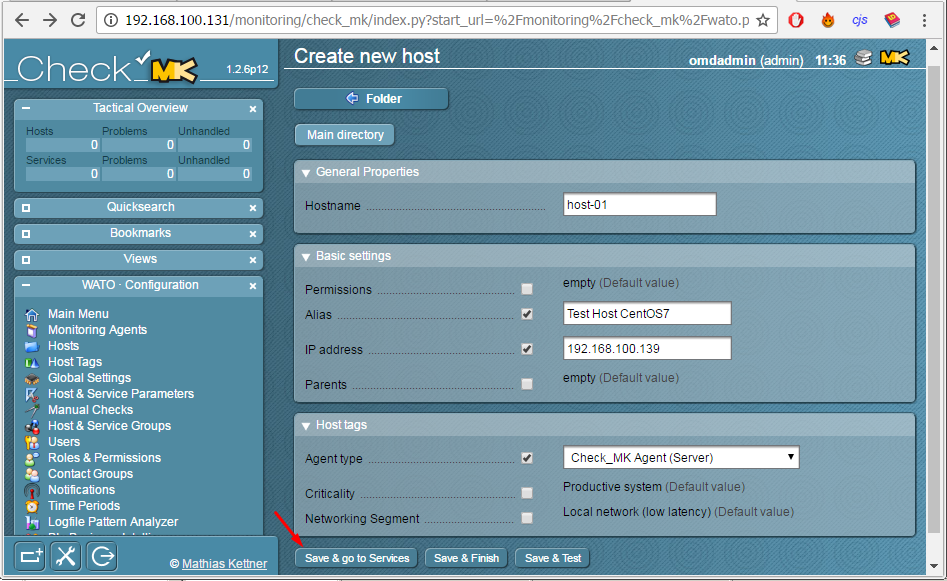
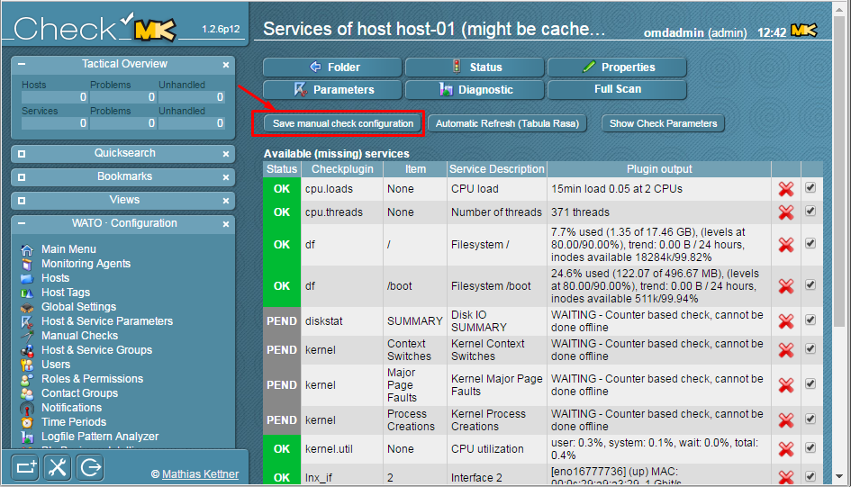
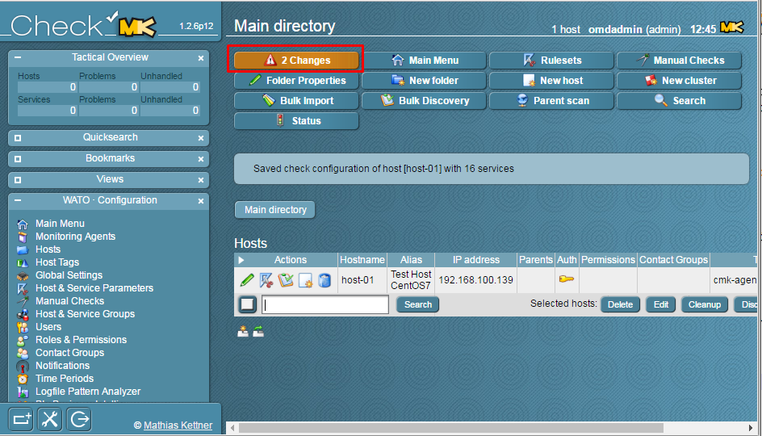
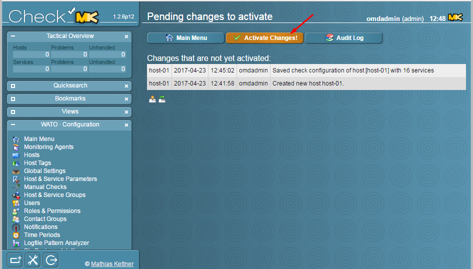
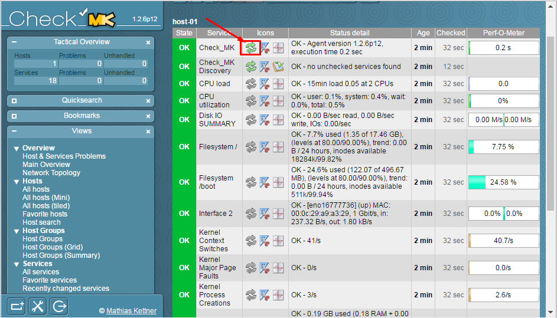

### 2. Cài đặt Agent trên Host giám sát

Đầu tiên, chúng ta vào Web UI để tải `Agent` cho client. Ở giao diện Web, chúng ta kéo xuống phần `WATO - Configuration`, chọn tiếp `Monitoring Agent`



Ở đây, có 3 packet dành cho 3 DISTRO:

- *.deb: Dành cho các host sử dụng DEBIAN
- *.rpm: Dành cho các host sử dụng RHEL
- *.msi: Dành cho các host sử dụng MS Windows

Ở phần này, tôi sẽ giám sát host CentOS 7. Vì thế tôi sẽ tải file `RPM`.

Quay trở lại host cần giám sát, chúng ta tải `agent` cho nó từ server.

```
wget http://192.168.100.131/monitoring/check_mk/agents/check-mk-agent-1.2.6p12-1.noarch.rpm --user omdadmin --password omd
```

**Lưu ý:** 
- Nếu bạn đã thay đổi password ở bước trên, vui lòng thay thế password của bạn vào câu lệnh. 
- Thay thế địa chỉ IP server vào câu lệnh trên.

Kiểm tra `xinet.d` đã được cài đặt.

```
rpm -qa | grep xinetd
```


Nếu câu lệnh không trả về kết quả như hình, vui lòng cài đặt theo lệnh sau:

```
yum install xinetd -y
```

Khởi động dịch vụ và cho chạy cùng hệ thống:

```
systemctl start xinetd
systemctl enable xinetd
```

Cài đặt `agent` bằng lệnh

```
rpm -ivh check-mk-agent-1.2.6p12-1.noarch.rpm
```



Để cho phép OMD Server được truy cập vào host, chúng ta chỉnh sửa file cấu hình `agent` trên host

```
vi /etc/xinetd.d/check_mk
```


Có 3 thông số chúng ta cần phải chỉnh cho chính xác:

- port: 6556
- only_from: Thêm địa chỉ IP server OMD của bạn
- disable: no (Có nghĩa cho phép dịch vụ chạy)

Sau khi chỉnh xong, chúng ta lưu lại file và khởi động lại `xinetd`.

```
systemctl restart xinetd
```

Kiểm tra port đã hoạt động

```
netstat -npl | grep 6556
```


Nếu không có lệnh `netstat` vui lòng cài tiện ích `net-tools`:

```
yum install -y net-tools
```

Quay trở lại Web UI, chúng ta sẽ thêm mới 1 host. Đầu tiên, Vào Menu `WATO Configuration`, chọn `Hosts` và click vào `Create new host`


Điền thông tin của host của bạn như hình:



Click vào `Save & go to Services`, sau đó Server sẽ thu thập thông tin từ Agent cài trên host giám sát.



Click tiếp vào `Save manual check configuration` để lưu.

Một host mới đã được thêm, bấm vào ô màu cam `2 Changes` để active những thay đổi:


 



Các thay đổi được Appy thành công.

Tại Tab `View`, `Services` > `All Services`, click vào biểu tượng `Rerfesh` để force check dịch vụ:

