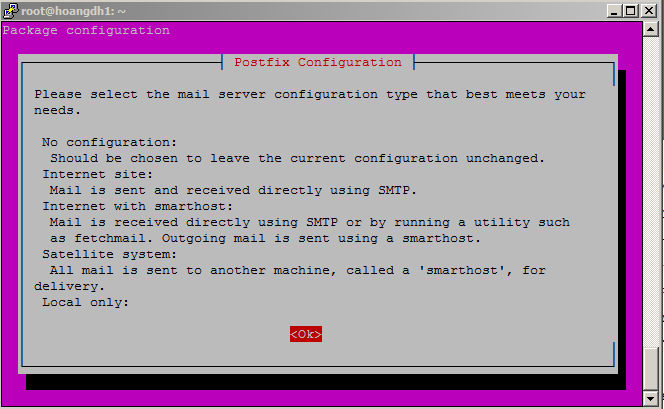
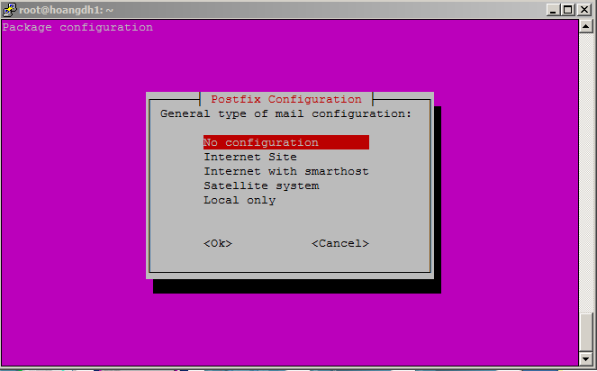
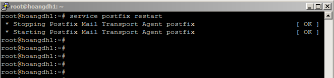
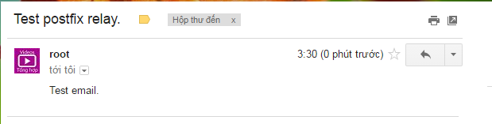
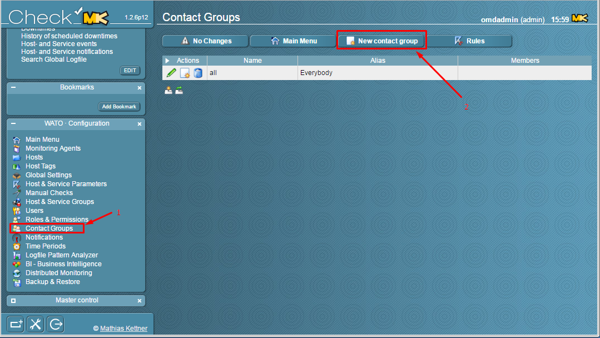
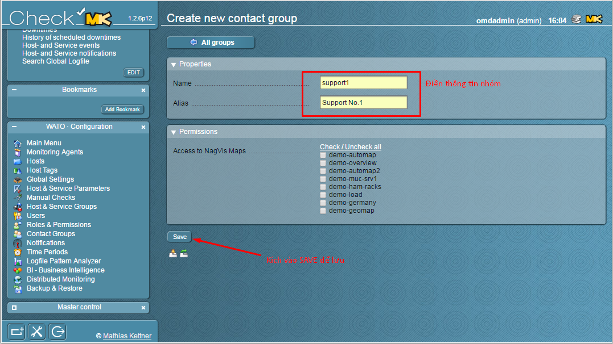
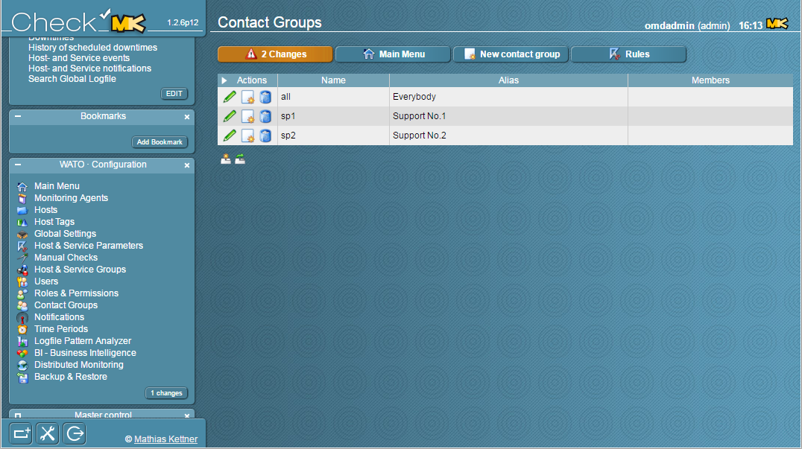

# Hướng dẫn gửi mail cảnh báo trong OMD

### Menu

- [1. Cấu hình mail relay sử dụng Gmail](1)
- [2. Cấu hình gửi mail trong OMD](2)
    - [2.1 Cho Host](2.1)
    - [2.2 Cho Services](2.2)
    - [2.3 Cấu hình cảnh báo leo thang](2.3)
    
## 1. Cấu hình mail relay sử dụng Gmail

Chúng ta thực hiện các bước sau để có thể sử dụng Gmail để cho OMD có thể gửi cảnh báo tới các kỹ thuật viên khi có sự cố xảy ra với host/dịch vụ.

** Trên OMD server, chúng ta thực hiện các bước sau để cấu hình Postfix thành một Mail Relay sử dụng Gmail.

- **Bước 1**: Cài đặt `postfix` và gói `mailutils`

```
apt-get update
apt-get install postfix mailutils
```

Khi có một Prompt xuất hiện giải thích một số tùy chọn của Postfix, chúng ta làm như sau:



Chọn **No configuration**



Chờ một lát cho quá trình cài đặt hoàn thành.

- **Bước 2**: Cấu hình xác thực cho Gmail

Các file cấu hình của **postfix** được lưu trữ trong `/etc/postfix`, chúng ta tạo file để lưu trữ thông tin của Gmail.

```
vi /etc/postfix/sasl_passwd
```

Thêm nội dung sau:

```
[smtp.gmail.com]:587    username@gmail.com:password
```

- **Chú thích:**

    - `username`: Tên đăng nhập Gmail
    - `password`: Mật khẩu của Gmail

Sau khi chỉnh sửa xong, chúng ta lưu lại file và phân quyền cho nó.

```
chmod 600 /etc/postfix/sasl_passwd
```

- **Bước 3**: Cấu hình `Postfix`

Tạo file cấu hình `/etc/postfix/main.cf`

```
vi /etc/postfix/main.cf
```

Và thêm vào đó những dòng sau:

```
relayhost = [smtp.gmail.com]:587
smtp_use_tls = yes
smtp_sasl_auth_enable = yes
smtp_sasl_security_options =
smtp_sasl_password_maps = hash:/etc/postfix/sasl_passwd
smtp_tls_CAfile = /etc/ssl/certs/ca-certificates.crt
```

- **Bước 4**: Xử lý thông tin xác thực Gmail

Sử dụng `postmap` để mã hóa file xác thực, kết quả mã hóa được lưu tại `sasl_passwd.db`

```
postmap /etc/postfix/sasl_passwd
```

- **Bước 5**: Khởi động lại `postfix`

```
service postfix restart
```



- **Bước 6**: Cài đặt Gmail, cho phép truy cập bằng ứng dụng kém an toàn

Truy cập vào link https://myaccount.google.com/lesssecureapps?pli=1 để cài đặt tính năng này.

- **Bước 7**: Kiểm tra Mail relay

Chúng ta kiểm tra hoạt động của nó bằng cách gửi đi một email:

```
echo "Test email." | mail -s "Test postfix relay." nobody@example.com
```

**Lưu ý**: Thay địa chỉ email của bạn vào câu lệnh.

Vào hộp thư của bạn kiểm tra email.



## 2. Cấu hình gửi mail trong OMD
### 2.1 Cho Host

- **Bước 1**:
- **Bước 2**:
- **Bước 3**:
- **Bước 4**:
- **Bước 5**:
- **Bước 6**:
- **Bước 7**:
- **Bước 8**:
- **Bước 9**:
- **Bước 10**:

### 2.2 Cho Services

- **Bước 1**:
- **Bước 2**:
- **Bước 3**:
- **Bước 4**:
- **Bước 5**:
- **Bước 6**:
- **Bước 7**:
- **Bước 8**:
- **Bước 9**:
- **Bước 10**:

### 2.3 Cấu hình cảnh báo leo thang

- **Bước 1**: Tạo các Group nhận cảnh báo

Ở menu, vào tab **WATO · Configuration**, chọn tiếp phần **Contact Groups**

Tối thiểu, chúng ta phải tạo 2 nhóm để có thể kiểm tra tính năng này.



Tạo nhóm thứ nhất:



Tương tự, chúng ta tạo nhóm thứ hai:


Sau khi tạo xong 2 nhóm, OMD sẽ thông báo có `2 changes`. Chưa cần `Apply` các change này, chúng ta sẽ cấu hình thêm cho OMD.



- **Bước 2**:


- **Bước 3**:
- **Bước 4**:
- **Bước 5**:
- **Bước 6**:
- **Bước 7**:
- **Bước 8**:
- **Bước 9**:
- **Bước 10**:
